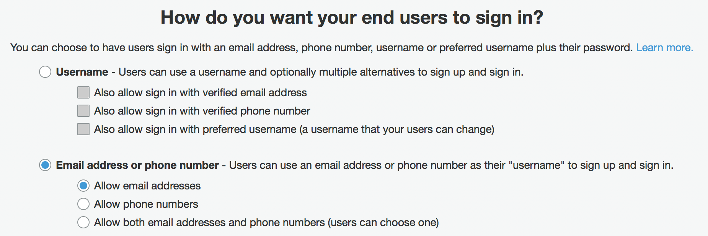

---
---

# Authentication

AWS Amplify Authentication module provides Authentication APIs and building blocks for developers who want to create user authentication experiences.

Depending on your needs, you can integrate Authentication module at different levels. You can use pre-built UI components for common sign-in/registration scenarios, or you can create your own custom user experience with the API.

**Amazon Cognito**

AWS Amplify uses Amazon Cognito as the default authentication provider. Before start working with Authentication category, it is important to understand *Amazon Cognito User Pools* and *Amazon Cognito Federated Identities*.

[Amazon Cognito User Pools](https://docs.aws.amazon.com/cognito/latest/developerguide/cognito-user-identity-pools.html) is a full-blown user directory service to handle user registration, authentication, and account recovery. [Amazon Cognito Federated Identities](https://docs.aws.amazon.com/cognito/latest/developerguide/cognito-identity.html) on the other hand, is a way to authorize your users to use the various AWS services. With an identity pool, you can obtain temporary AWS credentials with permissions you define to access other AWS services directly or to access resources through Amazon API Gateway.

When working together, Cognito User Pools acts as a source of user identities (identity provider) for the Cognito Federated Identities, as other sources could be OpenID, Facebook, Google, etc. AWS Amplify uses User Pools to store your user information and handle authorization, and it leverages Federated Identities to manage user access to AWS Resources, like allowing a user to upload a file to your S3 bucket.

## Installation and Configuration

Please refer to [AWS Amplify Installation Guide]({{site.amplify.baseurl}}/media/install_n_config) for general setup. Here is how you can enable Authentication category for your app.

### Automated Setup

To create a project fully functioning with the Auth category.

```bash
$ npm install -g awsmobile-cli
$ cd my-app #Change to your project's root folder
$ awsmobile init
$ awsmobile user-signin enable
$ awsmobile push #Update your backend
```

In your app's entry point i.e. App.js, import and load the configuration file `aws-exports.js` which has been created and replaced into `/src` folder in the previous step.

```js
import Amplify, { Auth } from 'aws-amplify';
import aws_exports from './aws-exports'; // specify the location of aws-exports.js file on your project
Amplify.configure(aws_exports);
```

##### Customizing Sign-in Options

You can customize sign-in options by using `-p` parameter. The CLI will ask you the options to create your custom sign-in attributes:

```sh
$ awsmobile user-signin enable -p

? Sign-in is currently disabled, what do you want to do next Go to advance settings
? Which sign-in method you want to configure Cognito UserPools (currently disabled)
? How are users going to login Email
? Password minimum length (number of characters) 8
? Password character requirements uppercase, lowercase, numbers

$ awsmobile push
```

##### Updating User Pool Attributes

Currently, once you create a Cognito User Pool, you won't be able to change the standard attributes at a later time. If you need to modify User Pool attributes, you can remove the user pool with `awsmobile user-signin disable` and create a new User Pool with the CLI.

{: style="max-height:400px;"}

### Manual Setup

With manual setup, you need to use your AWS Resource credentials to configure your app:

```js
import Amplify from 'aws-amplify';

Amplify.configure({
    Auth: {

        // REQUIRED only for Federated Authentication - Amazon Cognito Identity Pool ID
        identityPoolId: 'XX-XXXX-X:XXXXXXXX-XXXX-1234-abcd-1234567890ab',
        
        // REQUIRED - Amazon Cognito Region
        region: 'XX-XXXX-X',

        // OPTIONAL - Amazon Cognito User Pool ID
        userPoolId: 'XX-XXXX-X_abcd1234',

        // OPTIONAL - Amazon Cognito Web Client ID (26-char alphanumeric string)
        userPoolWebClientId: 'a1b2c3d4e5f6g7h8i9j0k1l2m3',

        // OPTIONAL - Enforce user authentication prior to accessing AWS resources or not
        mandatorySignIn: false,

        // OPTIONAL - Configuration for cookie storage
        cookieStorage: {
        // REQUIRED - Cookie domain (only required if cookieStorage is provided)
            domain: '.yourdomain.com',
        // OPTIONAL - Cookie path
            path: '/',
        // OPTIONAL - Cookie expiration in days
            expires: 365,
        // OPTIONAL - Cookie secure flag
            secure: true
        }
    }
});
```

### Node.js Support

Authorization category is designed to work in the browser. If you want to use it in Node.js, you may need to implement a polyfill to replace browser's Fetch API:

```sh
$ yarn add node-fetch
```

Load the pollyfill in your Node app:

```js
global.fetch = require('node-fetch');
```

## Working with the API

### Common Authentication Use Cases

AWS Amplify Authentication module exposes set of APIs to be used in any JavaScript framework. Please check [AWS Amplify API Reference]({{site.amplify.baseurl}}/api/classes/authclass.html) for full API list.

Here, we provide examples for most common authentication use cases:

#### Sign In

Sign in with user credentials:

```js
import { Auth } from 'aws-amplify';

Auth.signIn(username, password)
    .then(user => console.log(user))
    .catch(err => console.log(err));

// If MFA is enabled, sign-in should be confirmed with the congirmation code
// `user` : Return object from Auth.signIn()
// `code` : Confirmation code  
// `mfaType` : MFA Type e.g. SMS, TOTP.
Auth.confirmSignIn(user, code, mfaType)
    .then(data => console.log(data))
    .catch(err => console.log(err));
```

#### Sign Up

Creates a new user in your User Pool:

```js
import { Auth } from 'aws-amplify';

Auth.signUp({
    username,
    password,
    attributes: {
        email,          // optional
        phone_number,   // optional - E.164 number convention
        // other custom attributes 
    },
    validationData: []  //optional
    })
    .then(data => console.log(data))
    .catch(err => console.log(err));

// After retrieveing the confirmation code from the user
Auth.confirmSignUp(username, code, {
    // Optional. Force user confirmation irrespective of existing alias. By default set to True.
    forceAliasCreation: true    
}).then(data => console.log(data))
  .catch(err => console.log(err));
```

**Forcing Email Uniqueness in Cognito User Pools**

When your User Pool sign-in options are set to "*Username*", and "*Also allow sign in with verified email address*", *signUp()* creates a new user account without validating email uniqueness. In this case you will have multiple user pool identities and previous account's attribute is changed to *email_verified : false*. 

To restrict signups with unique email, you can change your User Pool settings in your user pool's *Attributes* settings as following:
{: style="max-height:300px;"}

#### Sign Out
```js
import { Auth } from 'aws-amplify';

Auth.signOut()
    .then(data => console.log(data))
    .catch(err => console.log(err));
```

#### Change password
```js
import { Auth } from 'aws-amplify';

Auth.currentAuthenticatedUser()
    .then(user => {
        return Auth.changePassword(user, 'oldPassword', 'newPassword');
    })
    .then(data => console.log(data))
    .catch(err => console.log(err));
```

#### Forgot Password
```js
import { Auth } from 'aws-amplify';

Auth.forgotPassword(username)
    .then(data => console.log(data))
    .catch(err => console.log(err));

// Collect confirmation code and new password, then
Auth.forgotPasswordSubmit(username, code, new_password)
    .then(data => console.log(data))
    .catch(err => console.log(err));
```

#### Retrieve Current Session

`Auth.currentSession()` returns a `CognitoUserSession` object which contains JWT `accessToken`, `idToken`, and `refreshToken`.

```js
let session = Auth.currentSession();
// CognitoUserSession => { idToken, refreshToken, accessToken }
```

#### Managing Security Tokens

**When using Authentication with AWS Amplify, you don't need to refresh Amazon Cognito tokens manually. The tokens are automatically refreshed by the library when necessary.**

If you are using `amazon-cognito-identity-js` package directly in your app, you need to monitor token expiration and refresh your tokens in your code. Following code sample shows how to refresh tokens:

```js
var data = { UserPoolId : 'us-east-1_resgd', ClientId : 'xyz' };
var userPool = new AmazonCognitoIdentity.CognitoUserPool(data);
var cognitoUser = userPool.getCurrentUser();

if (cognitoUser != null) {
    cognitoUser.getSession(function(err, session) {
        if (err) { alert(err); return; }

        // Get refresh token before refreshing session
        refresh_token = session.getRefreshToken();

        if (AWS.config.credentials.needsRefresh()) {
            cognitoUser.refreshSession(refresh_token, (err, session) => {
                if(err) { console.log(err); } 
                else {
                    AWS.config.credentials.params.Logins['cognito-idp.<YOUR-REGION>.amazonaws.com/<YOUR_USER_POOL_ID>']  = session.getIdToken().getJwtToken();
                    AWS.config.credentials.refresh((err)=> {
                        if(err)  { console.log(err); }
                        else{
                            console.log("TOKEN SUCCESSFULLY UPDATED");
                        }
                    });
                }
            });
        }
    });
}

```

To learn more about tokens, please visit [Amazon Cognito Developer Documentation](https://docs.aws.amazon.com/cognito/latest/developerguide/amazon-cognito-user-pools-using-tokens-with-identity-providers.html).

### Using withAuthenticator HOC

For React and React Native apps, the simplest way to add authentication flows into your app is to use *withAuthenticator* High Order Component.

*withAuthenticator* automatically detects the authentication state and updates the UI. If the user is signed in, the underlying component (typically your app's main component) is displayed otherwise signing/signup controls is displayed.

Just add these two lines to your `App.js`:

```js
import { withAuthenticator } from 'aws-amplify-react'; // or 'aws-amplify-react-native';
...
export default withAuthenticator(App);
```
Now, your app has complete flows for user sign-in and registration. Since you have wrapped your **App** with `withAuthenticator`, only signed in users can access your app. The routing for login pages and giving access to your **App** Component will be managed automatically:


#### Enabling Federated Identities

You can enable federated Identity login by specifying  *federated* option. Here is a configuration for enabling social login with multiple providers:

```js
const AppWithAuth = withAuthenticator(App);

const federated = {
    google_client_id: '',
    facebook_app_id: '',
    amazon_client_id: ''
};

ReactDOM.render(<AppWithAuth federated={federated}/>, document.getElementById('root'));
```

You can also initiate a federated signin process by calling `Auth.federatedSignIn()` method with a specific identity provider in your code:  

```js
import { Auth } from 'aws-amplify';

// Retrieve active Google user session
const ga = window.gapi.auth2.getAuthInstance();
ga.signIn().then(googleUser => {
    const { id_token, expires_at } = googleUser.getAuthResponse();
    const profile = googleUser.getBasicProfile();
    const user = {
        email: profile.getEmail(),
        name: profile.getName()
    };

    return Auth.federatedSignIn(
        // Initiate federated sign-in with Google identity provider 
        'google',
        { 
            // the JWT token
            token: id_token, 
            // the expiration time
            expires_at 
        },
        // a user object
        user
    ).then(() => {
        // ...
    });
});
```

After the federated login, you can retrieve related JWT token from the local cache using the *Cache* module: 
```js
import { Cache } from 'aws-amplify';

// Run this after the sign-in
Cache.getItem('federatedInfo').then(federatedInfo => {
     const { token } = federatedInfo;
});
```
Availible identity providers are `google`, `facebook`, `amazon`, `developer` and OpenID. To use an `OpenID` provider, use the URI of your provider as the key, e.g. `accounts.your-openid-provider.com`.

 NOTE: Federated Identity HOCs are not yet available on React Native.
 {: .callout .callout--info}

#### Rendering a Sign Out Button

`withAuthenticator` component renders your App component after a successful user signed in, and it prevents non-sign-in uses to interact with your app. In this case, we need to display a *sign-out* button to trigger the related process.

To display a sign-out button, set `includeGreetings = true` in the parameter object. It displays a *greetings section* on top of your app, and a sign-out button is displayed in the authenticated state.

```js
export default withAuthenticator(App, { includeGreetings: true });
```

### Using Authenticator Component

The `withAuthenticator` HOC essentially just wraps `Authenticator` component. Using `Authenticator` directly gives you more customization options for your UI.

#### Wrapping your Component

This will render your App component with *Authenticator*:

```js
import { Authenticator } from 'aws-amplify-react'; // or 'aws-amplify-react-native'
...

class AppWithAuth extends Component {
  render(){
    return (
      <div>
      <Authenticator>
        <App />
      </Authenticator>
      </div>
    );
  }
}

export default AppWithAuth;
```

#### Show your App After Sign-in

In the previous example, you'll see the App is rendered even before the user is signed-in. To change this behavior, you can use *Authenticator* properties. When inside `Authenticator`, the App component automatically receives those properties.

**authState** is the current authentication state (a string):
```
 - signIn
 - signUp
 - confirmSignIn
 - confirmSignUp
 - forgotPassword
 - verifyContact
 - signedIn
 ```

**authData** - additional data within authState; when the state is `signedIn`, it will return a `user` object.

Using the options above, to control the condition for *Authenticator* to render App component, simply set `_validAuthStates` property:

```js
this._validAuthStates = ['signedIn'];
```

Then, in the component's constructor,  implement `showComponent(theme) {}` in lieu of the typical `render() {}` method.

### Federated Identities (Social Sign-in)

**Availability Note**
Currently, our federated identity components only support Google, Facebook and Amazon identities. Please see our[ Setup Guide for Federated Identities]({{site.amplify.baseurl}}/media/federated_identity_setup).
{: .callout .callout--info}

To enable social sign-in in your app with Federated Identities, add `Google client_id`, `Facebook app_id` and/or `Amazon client_id` properties to *Authenticator* component:

```jsx
const federated = {
    google_client_id: '',
    facebook_app_id: '',
    amazon_client_id: ''
};

return (
    <Authenticator federated={federated}>
)
```

For *React Native*, you can use `Auth.federatedSignIn()` to get your federated identity from Cognito. You need to provide a valid JWT token from the third provider. You can also use it with `Authenticator`, so that component automatically persists your login status.

Federated Sign in with Facebook Example:
```js
import Expo from 'expo';
import Amplify, { Auth } from 'aws-amplify';
import { Authenticator } from 'aws-amplify-react-native';

export default class App extends React.Component {
  async signIn() {
    const { type, token, expires } = await Expo.Facebook.logInWithReadPermissionsAsync('YOUR_FACEBOOK_APP_ID', {
        permissions: ['public_profile'],
      });
    if (type === 'success') {
      // sign in with federated identity
      Auth.federatedSignIn('facebook', { token, expires_at: expires}, { name: 'USER_NAME' })
        .then(credentials => {
          console.log('get aws credentials', credentials);
        }).catch(e => {
          console.log(e);
        });
    }
  }

  // ...

  render() {
    return (
      <View style={styles.container}>
        <Authenticator>
        </Authenticator>
        <Button title="FBSignIn" onPress={this.signIn.bind(this)} />
      </View>
    );
  }
}
```

#### Customize UI

To customize the UI for Federated Identities sign-in, you can use `withFederated` component. The following code shows how you customize the login buttons and the layout for social sign-in.

```jsx
import { withFederated } from 'aws-amplify-react';

const Buttons = (props) => (
    <div>
        
        
        
    </div>
)

const Federated = withFederated(Buttons);

...

const federated = {
    google_client_id: '',
    facebook_app_id: '',
    amazon_client_id: ''
};

<Federated federated={federated} onStateChange={this.handleAuthStateChange} />
```

There is also `withGoogle`, `withFacebook`, `withAmazon` components, in case you need to customize a single provider.

### Using Amazon Cognito Hosted UI

Amazon Cognito provides a customizable user experience via the hosted UI. The hosted UI supports OAuth 2.0 and Federated Identities with Facebook, Amazon, Google, and SAML providers. To learn more about Amazon Cognito Hosted UI, please visit [Amazon Cognito Developer Guide](https://docs.aws.amazon.com/cognito/latest/developerguide/cognito-user-pools-configuring-app-integration.html).

#### Setup your Cognito App Client

To start using hosted UI, you need to setup your App Client in the Amazon Cognito console.

To setup App Client;
- Go to [Amazon Cognito Console](https://aws.amazon.com/cognito/).
- Click *User Pools* on the top menu to select a User Pool or create a new one.
- Click *App integration*  and *App client settings* on the left menu.
- Select *Enabled Identity Providers* and enter *Callback URL(s)* and *Sign out URL(s)* fields.
- Under the *OAuth 2.0* section, select an OAuth Flow. *Authorization code grant* is the recommended choice for security reasons.
- Choose item(s) from *OAuth Scopes*.
- Click 'Save Changes'

To enable the domain for your hosted UI;

- On the left menu, go to  *App integration* > *Domain name*.
- In the *Domain prefix* section, enter the prefix for the pages that will be hosted by Amazon Cognito.

You can also enable Federated Identities for your hosted UI;  

- Go to *Federation* > *Identity providers*
- Select an *Identity provider* and enter required credentials for the identity provider. (e.g., App Id, App secret, Authorized scope)
- In the settings page for your selected identity provider (Facebook, Google, etc.),  set *Oauth Redirected URI* to `https://your-domain-prefix.auth.us-east-1.amazoncognito.com/oauth2/idpresponse` (*your-domain-prefix* is the domain prefix you have entered in previously).
- To retrieve user attributes from your identity provider, go to *Federation* > *Attribute mapping*. Here, you can map Federation Provider attributes to corresponding User pool attributes. 

If  *email* attribute is a required field in your Cognito User Pool settings, please make sure that you have selected *email* in your Authorized Scopes, and you have mapped it correctly to your User Pool attributes.
{: .callout .callout-info}

#### Configuring the Hosted UI

To configure your application for hosted UI, you need to use *oauth* options:

```js
import Amplify from 'aws-amplify';

const oauth = {
    // Domain name
    domain : 'your-domain-prefix.auth.us-east-1.amazoncognito.com', 
    
    // Authorized scopes
    scope : ['phone', 'email', 'profile', 'openid','aws.cognito.signin.user.admin'], 

    // Callback URL
    redirectSignIn : 'http://www.example.com/signin', 
    
    // Sign out URL
    redirectSignOut : 'http://www.example.com/signout',

    // 'code' for Authorization code grant, 
    // 'token' for Implicit grant
    responseType: 'code'

    // optional, for Cognito hosted ui specified options
    options: {
        // Indicates if the data collection is enabled to support Cognito advanced security features. By default, this flag is set to true.
        AdvancedSecurityDataCollectionFlag : true
    }
}

Amplify.configure({
    Auth: {
        // other configurations...
        // ....
        oauth: oauth
    },
    // ...
});
```

#### Launching the Hosted UI

To invoke the browser to display the hosted UI, you need to construct the URL in your app;

```js
const config = Auth.configure();
const { 
    domain,  
    redirectSignIn, 
    redirectSignOut,
    responseType } = config.oauth;

const clientId = config.userPoolWebClientId;
const url = 'https://' + domain + '/login?redirect_uri=' + redirectSignIn + '&response_type=' + responseType + '&client_id=' + clientId;

// Launch hosted UI
window.location.assign(url);
```

#### Launching the Hosted UI in React 

With React, you can use `withOAuth` HOC to launch the hosted UI experience. Just wrap your app's main component with our HOC:

```js
import { withOAuth } from 'aws-amplify-react';

class MyApp extends React.Component {
    // ...
    render() {
        return(
            <button onClick={this.props.OAuthSignIn}>
                Sign in with AWS
            </button>
        )
    }
}

export default withOAuth(MyApp);
``` 
    
### Enabling MFA

MFA (Multi-factor authentication increases security for your app by adding an authentication method and not relying solely on the username (or alias) and password. AWS Amplify uses Amazon Cognito to provide MFA. Please see [Amazon Cognito Developer Guide](https://docs.aws.amazon.com/cognito/latest/developerguide/user-pool-settings-mfa.html) for more information about setting up MFA in Amazon Cognito.

Once you enable MFA on Amazon Cognito, you can configure your app to work with MFA.

#### Enabling TOTP

With TOTP (Time-based One-time Password), your app user is challenged to complete authentication using a time-based one-time (TOTP) password after their username and password have been verified.

You can setup TOTP for a user in your app:

```js
import { Auth } from 'aws-amplify';

// To setup TOTP, first you need to get a `authorization code` from Amazon Cognito
// `user` is the current Authenticated user
Auth.setupTOTP(user).then((code) => {
    // You can directly display the `code` to the user or convert it to a QR code to be scanned.
    // E.g., use following code sample to render a QR code with `qrcode.react` component:  
    //      import QRCode from 'qrcode.react';
    //      const str = "otpauth://totp/AWSCognito:"+ username + "?secret=" + code + "&issuer=" + issuer;
    //      <QRCode value={str}/>
});

// ...

// Then you will have your TOTP account in your TOTP-generating app (like Google Authenticator)
// Use the generated one-time password to verify the setup
Auth.verifyTotpToken(user, challengeAnswer).then(() => {

    // don't forget to set TOTP as the preferred MFA method
    Auth.setPreferredMFA(user, 'TOTP');
    // ...
}).catch( e => {
    // Token is not verified
});
```

#### Setup MFA Type

There are multiple MFA types supported by Amazon Cognito. You can set the preferred method in your code:

```js
import { Auth } from 'aws-amplify';

// You can select preferred mfa type, for example:
// Select TOTP as preferred
Auth.setPreferredMFA(user, 'TOTP').then((data) => {
    console.log(data);
    // ...
}).catch(e => {});

// Select SMS as preferred
Auth.setPreferredMFA(user, 'SMS');

// Select no-mfa
Auth.setPreferredMFA(user, 'NOMFA');
```

#### Letting User Select MFA Type

When working with multiple MFA Types, you can let the app user select the desired authentication method. `SelectMFAType` UI Component, which is provided with `aws-amplify-react` package, renders a list of available MFA types.

```js
import Amplify from 'aws-amplify';
import awsmobile from './aws-exports';
import { SelectMFAType } from 'aws-amplify-react';

Amplify.configure(awsmobile);

// Please have at least TWO types
// Please make sure you set it properly according to your Cognito User pool
const MFATypes = {
    SMS: true, // if SMS enabled in your user pool
    TOTP: true, // if TOTP enabled in your user pool
    Optional: true, // if MFA is set to optional in your user pool
}

class App extends Component {
    // ...
    render() {
        return (
            // ...
            <SelectMFAType authData={this.props.authData} MFATypes={MFATypes}>
        )
    }
}

export default withAuthenticator(App, true);
```

### Customizing Authentication Flow

Amazon Cognito User Pools support customizing the authentication flow to enable new challenge types, in addition to a password, to verify the identity of users. These challenge types may include CAPTCHAs or dynamic challenge questions. 

To define your challenges for custom authentication flow, you need to implement Lambda triggers for Amazon Cognito.

#### Creating a CAPTCHA

The following Lambda creates a CAPTCHA as a challenge to the user. The URL for the CAPTCHA image and  the expected answer is added to the private challenge parameters:

```js
export const handler = async (event) => {
    if (!event.request.session || event.request.session.length === 0) {
        event.response.publicChallengeParameters = {
            captchaUrl: "url/123.jpg",
        };
        event.response.privateChallengeParameters = {
            answer: "5",
        };
        event.response.challengeMetadata = "CAPTCHA_CHALLENGE";
    }
    return event;
};
```

#### Defining a Custom Challange

This example defines a custom challenge:

```js
export const handler = async (event) => {
    if (!event.request.session || event.request.session.length === 0) {
        // If we don't have a session or it is empty then send a CUSTOM_CHALLENGE
        event.response.challengeName = "CUSTOM_CHALLENGE";
        event.response.failAuthentication = false;
        event.response.issueTokens = false;
    } else if (event.request.session.length === 1 && event.request.session[0].challengeResult === true) {
        // If we passed the CUSTOM_CHALLENGE then issue token
        event.response.failAuthentication = false;
        event.response.issueTokens = true;
    } else {
        // Something is wrong. Fail authentication
        event.response.failAuthentication = true;
        event.response.issueTokens = false;
    }

    return event;
};
```

**Verify Challenge Response** 

This Lambda is used to verify a challange answer:

```js
export const handler = async (event, context) => {
    if (event.request.privateChallengeParameters.answer === event.request.challengeAnswer) {
        event.response.answerCorrect = true;
    } else {
        event.response.answerCorrect = false;
    }

    return event;
};
```

For more information about working with Lambda Triggers for custom authentication challenge, please visit [Amazon Cognito Developer Documentation](https://docs.aws.amazon.com/cognito/latest/developerguide/user-pool-lambda-challenge.html).
{: .callout .callout--info}

#### Using a Custom Challange 

To initiate a custom authorization flow in your app, call `signIn` without a password. A custom challenge needs to be answered using the `sendCustomChallengeAnswer` method:

```js
import { Auth } from 'aws-amplify';
let challangeResponse = "the answer for the challenge";

Auth.signIn(username)
    .then(user => {
        if (user.challengeName === 'CUSTOM_CHALLENGE') {
            Auth.sendCustomChallengeAnswer(user, challangeResponse)
                .then(user => console.log(user))
                .catch(err => console.log(err));
        } else {
            console.log(user);
        }
    })
    .catch(err => console.log(err));
```

### Working with User Attributes

You can pass user attributes during sign up:

```js
Auth.signUp({
    'username': 'jdoe',
    'password': 'mysecurerandompassword#123',
    'attributes': {
        'email': 'me@domain.com',
        'phone_number': '+12128601234', // E.164 number convention
        'given_name': 'Jane',
        'family_name': 'Doe',
        'nickname': 'Jane'
    }
});
```

You can retrieve user attributes:

```js
let user = await Auth.currentAuthenticatedUser();
```

You can update user attributes:

```js
let result = await Auth.updateUserAttributes(user, {
    'email': 'me@anotherdomain.com',
    'family_name': 'Lastname'
});
console.log(result); // SUCCESS
```

If you change the email address, the user you will receive a confirmation code. In your app, you can confirm the verification code:

```js
let result = await Auth.verifyCurrentUserAttributeSubmit('email', 'abc123');
```

### Subscribing Events

You can take specific actions when users sign-in or sign-out by subscribing authentication events in your app. Please see our [Hub Module Developer Guide]({{site.amplify.baseurl}}/media/hub_guide#listening-authentication-events) for more information.


### Working with AWS Service Objects

You can use AWS *Service Interface Objects* to work AWS Services in authenticated State. You can call methods on any AWS Service interface object by passing your credentials from `Auth` object to the service call constructor:

```js
import Route53 from 'aws-sdk/clients/route53';

Auth.currentCredentials()
  .then(credentials => {
    const route53 = new Route53({
      apiVersion: '2013-04-01',
      credentials: Auth.essentialCredentials(credentials)
    });

    // more code working with route53 object
    // route53.changeResourceRecordSets();
  })
```

Full API Documentation for Service Interface Objects is available [here](https://docs.aws.amazon.com/AWSJavaScriptSDK/latest/_index.html).

Note: To work with Service Interface Objects, your Amazon Cognito users' [IAM role](https://docs.aws.amazon.com/cognito/latest/developerguide/iam-roles.html) must have the appropriate permissions to call the requested services.
{: .callout .callout--warning}


### API Reference

For the complete API documentation for Authentication module, visit our [API Reference]({{site.amplify.baseurl}}/api/classes/authclass.html)
{: .callout .callout--info}

## Customization

### Customize UI Theme

AWS Amplify's default UI components are theme based. To see the default styling, check  `AmplifyTheme.js` for the related package in our repo.

You can create your own theme, and use it to render Amplify components:

```jsx
import MyTheme from './MyTheme';

<Authenticator theme={MyTheme} />
```

Alternatively, you can import and override `AmplifyTheme` component in your code to apply style changes:

```jsx
import { AmplifyTheme } from 'aws-amplify-react';

const MySectionHeader = Object.assign({}, AmplifyTheme.sectionHeader, { background: 'orange' });
const MyTheme = Object.assign({}, AmplifyTheme, { sectionHeader: MySectionHeader });

<Authenticator theme={MyTheme} />
```

A sample theme can be found [here](https://github.com/richardzcode/a-theme-react).
{: .callout .callout--info}

### Create Your Own UI

To customize the default auth experience even more, you can create your own auth UI. To do this, your component will leverage the following *Authenticator* properties:

```
- authState
- authData
- onStateChange
```

The following example creates an 'Always On' Auth UI, which continuously shows the current auth state in your app.

```jsx
import { Authenticator, SignIn, SignUp, ConfirmSignUp, Greetings } from 'aws-amplify-react';

const AlwaysOn = (props) => {
    return (
        <div>
            <div>I am always here to show current auth state: {props.authState}</div>
            <button onClick={() => props.onStateChange('signUp')}>Show Sign Up</button>
        </div>
    )
}

handleAuthStateChange(state) {
    if (state === 'signedIn') {
        /* Do something when the user has signed-in */
    }
}

render() {
    return (
        <Authenticator hideDefault={true} onStateChange={this.handleAuthStateChange}>
            <SignIn/>
            <SignUp/>
            <ConfirmSignUp/>
            <Greetings/>
            <AlwaysOn/>
        </Authenticator>
    )
}
```

### Composing Your Own Authenticator

`Authenticator` is designed as a container for a number of Auth components. Each component does a single job, e.g., SignIn, SignUp, etc. By default, all of this elements are visible depending on the authentication state. 

If you want to replace some or all of the Authenticator elements, you need to set `hideDefault={true}`, so the component doesn't render its default view. Then you can pass in your own set of child components that listen to `authState` and decide what to do. 

You can also pass the child components you want to use. For example, the following Authenticator configuration only renders *Greetings* component which has a *Sign Out* button:

```jsx
<Authenticator hideDefault={true}>
    <Greetings />
</Authenticator>
```

#### Customize Greeting message

The *Greetings* component has two states: signedIn, and signedOut. To customize the greeting message, set properties `inGreeting` and `outGreeting` using a string or function.

```jsx
<Authenticator hideDefault={true}>
    <Greetings
        inGreeting={(username) => 'Hello ' + username}
        outGreeting="Please sign in..."
    />
</Authenticator>
```

### Customize `withAuthenticator`

The `withAuthenticator` HOC gives you some nice default authentication screens out-of-box. If you want to use your own components rather then provided default components, you can pass the list of customized components to `withAuthenticator`:

```js
import React, { Component } from 'react';
import { ConfirmSignIn, ConfirmSignUp, ForgotPassword, SignIn, SignUp, VerifyContact, withAuthenticator } from 'aws-amplify-react';

class App extends Component {
  render() {
    ...
  }
}

// This is my custom Sign in component
class MySignIn extends SignIn {
  render() {
    ...
  }
}

export default withAuthenticator(App, false, [
  <MySignIn/>,
  <ConfirmSignIn/>,
  <VerifyContact/>,
  <SignUp/>,
  <ConfirmSignUp/>,
  <ForgotPassword/>
]);
```

### Customize Error Messages

During authentication flows, Amplify handles error messages returned from the server. Amplify provides a simple way of customizing those error messages with a `messageMap` callback.

The function takes the original message as arguments and then outputs the desired message. Check `AmplifyMessageMap.js` file to see how Amplify makes the map function.

```jsx
const map = (message) => {
    if (/incorrect.*username.*password/i.test(message)) {
        return 'Incorrect username or password';
    }

    return message;
}

<Authenticator errorMessage={map} />
```

You may notice in `AmplifyMessageMap.js` it also handles internationalization. This topic is covered in our [I18n Guide]({{site.amplify.baseurl}}/media/i18n_guide).

### Customize Text Labels

You can change the text for the labels (like 'Sign In' and 'Sign Up') on the built-in user interface by providing your own dictionary to the localization engine:

```jsx
import { I18n } from 'aws-amplify';

const authScreenLabels = {
    en: {
        'Sign Up': 'Create new account',
        'Sign Up Account': 'Create a new account'
    }
};

I18n.setLanguage('en');
I18n.putVocabularies(authScreenLabels);
```