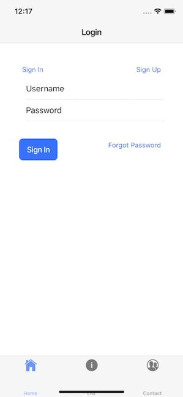
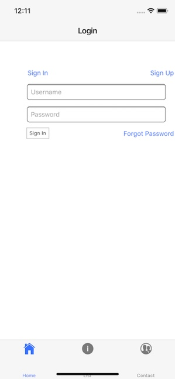

<html>
  <head>
        <!-- Global site tag (gtag.js) - Google Analytics -->     <script async src="https://www.googletagmanager.com/gtag/js?id=UA-115615468-1"></script>     <script>         window.dataLayer = window.dataLayer || [];         function gtag(){dataLayer.push(arguments);}         gtag('js', new Date());         gtag('config', 'UA-115615468-1',{             'linker': {             'domains': ['aws-amplify.github.io']             }         });         var navigateToNextPage = function (elem) {             var path = "{{ site.amplify.docs_baseurl }}/media/quick_start";             location.replace( path + location.search);         };       gtag('event', 'page_view', {         'event_callback': navigateToNextPage         });     </script> <meta http-equiv="refresh" content="5; url={{ site.amplify.docs_baseurl }}/media/quick_start" />
  </head>
  <body>
    <p>Redirecting to <a href="{{ site.amplify.docs_baseurl }}/media/quick_start">https://aws-amplify.github.io/amplify-js/media/quick_start</a></p>
  </body>
</html>
Building Ionic 4 apps with AWS Amplify
===========

Overview
--------

In this tutorial, you will create an Ionic 4 ‘ToDo List’ app that connects to a serverless backend via the AWS Amplify Library.

The AWS Amplify and the Amplify CLI provides a developer experience that allows frontend JavaScript developers to create and integrate backend resources into their apps quickly. In this tutorial, you will learn how to build a cloud-enabled web app with Ionic and AWS Amplify.


**By completing this tutorial, you will be able to:**
- Bootstrap an Ionic 4 app with Ionic CLI and start working with the code
- Implement the AWS Amplify library into your app
- Manage your backend resources with the Amplify CLI
- Utilize AWS services such as Amazon Cognito, Amazon DynamoDB, and AWS Lambda

## Prerequisites

You need to have a basic understanding of JavaScript/[TypeScript](http://www.typescriptlang.org/), [Node.js](https://nodejs.org/en/about/), and [NPM](https://www.npmjs.com/) to complete this tutorial.

## Source Code

If you would like to get right to the source code, it can be found in [Github](https://github.com/aws-samples/aws-amplify-ionic-sample).  The different parts of this tutorial are represented by branches in this Github repo.

You can also copy and paste code sample while following the tutorials. In this case, please note that some sections of the code samples are **commented on purpose**. Please use the code with comments, as you'll remove the comments to enable new features throughout the tutorial.

## Content

Here is the sequence of the tutorial:
- Part 1: [Create an Ionic 4 App](#part-1-create-an-ionic-4-app)
- Part 2: [Working with Amplify CLI](#part-2-working-with-aws-mobile-cli)
- Part 3: [Adding Authorization](#part-3-adding-analytics)
- Part 4: [Enabling the Cloud Backend](#part-4-adding-authorization)
 
# Part 1: Create an Ionic 4 App

This section will introduce Ionic basics and you will learn how to bootstrap a new Ionic app with the Ionic CLI. In subsequent parts of the tutorial, you will add cloud functionality to the application that you will create in this section.

The source code for this section of the tutorial can be found in *tutorial-part-1* branch of the [project Github repo](https://github.com/aws-samples/aws-amplify-ionic-sample/tree/tutorial-part-1).
{: .callout}

## What is Ionic?

Ionic is a web development framework that allows developers to create cross-platform applications that run on mobile platforms such as iOS and Android, on the desktop using Electron.js, or in the browser as a progressive web app. Ionic applications have the ‘look-and-feel’ of native apps and also offer the ability (via Apache Cordova plugins) to access mobile OS features such as cameras, contact lists, etc.

Apache Cordova is an open source mobile development platform that runs web code (HTML, CSS, and JavaScript) in a WebView wrapped in a mobile app shell.  Since it is native code, it can be distributed on the app stores just like any other mobile app and presented as an app on mobile platforms.
 
## Install the Ionic CLI and Create the Base Project

The easiest way to create an Ionic 4 application is with the Ionic Command Line Interface (CLI). To install the Ionic CLI, run the following command in your terminal:

```bash
$ npm install -g ionic cordova
```

After installation, navigate to a location where you wish to start your new project and execute:

```bash
$ ionic start fancy-todos tabs --type=angular 
```
Ionic CLI will prompt some questions for you:

```bash
? Integrate your new app with Cordova to target native iOS and Android?
? Install the free Ionic Pro SDK and connect your app?  
```
If you want your application to run as an iOS or Android application as well as a browser-based one, select ‘y’ when asked if you want to integrate with Cordova. You will then be asked if you want to install the Ionic Pro SDK; you can select ‘y’ if you wish, but it is not necessary for this tutorial.

To confirm that you're using the correct version of Ionic, navigate into the project directory and execute 'ionic info'. The Ionic Framework value should be greater than 4.
{: .callout}
 
## Angular Modules in Ionic

Previous versions of Ionic made use of the Angular framework, and Ionic 4 is no exception. Modern versions of Angular provide a component-based architecture in which the application consists of components, which are in turn executed in the context of a module.

Each component typically consists of an HTML template, a module file, a component file, an SCSS (SASS stylesheet) file and a SPEC file used for testing. This form of architecture encourages developers to write code that is relatively easy to understand, extend, and debug.

In the ‘tabs’ Ionic starter that you've created, each of the three tabs is defined by its own module, which in turn consists of one component each.
 
If your application grows much larger, you can refactor it into multiple components per page. For example, in this tutorial, you will be adding a component to one of the modules which define the behavior and appearance of a modal dialog for adding and editing items.
 
##  Create the ToDo model and UI

In this section, you will replace the ‘About’ component that comes with the Ionic starter project with a ‘List’ component that holds the ToDo items created by the user.   The component you will create allows users to create or edit individual ToDo items with a modal. The user will also be able to delete items and mark items as complete by interacting with an item in the list.

To being this process, create a directory called *src/app/pages/list*.

### Define the data model

First, create a new directory under *src/app* called `classes`.  Then copy the following code into a new file *src/app/classes/item.class.ts*, this will define the model for the ToDo list item. 

The base Ionic project uses TypeScript, which will later be compiled into JavaScript. 
{:  .callout .callout--info}

```js
import { v4 as uuid } from 'uuid';

export class ToDoList {
  userId: any;
  items: Array<ToDoItem>

  constructor(params){
    this.items = params.items || [];
    this.userId = params.userId;
  }
}

export class ToDoItem {
  id: string;
  title: string;
  description: string;
  status: any;
  
  constructor(params){
    this.id = uuid();
    this.title = params.title;
    this.description = params.description;
    this.status = 'new';
  }
}
```

This file defines the data model for *ToDoList* and *ToDoItem*.  The list is a list of items, and each item has an ID, title, description, and status. 

### Create a list component

Create a new file as your list component under *src/app/pages/list/list.page.ts*. This file will define the functionality of the list component. 

```js
import { Component, OnInit, Input } from '@angular/core';
import { ModalController, Events } from '@ionic/angular';
// import { ListItemModal } from './list.item.modal';
import { ToDoItem, ToDoList } from '../../classes/item.class';

@Component({
  selector: 'app-list-page',
  templateUrl: 'list.page.html',
  styleUrls: ['list.page.scss']
})
export class ListPage implements OnInit {

  modal: any;
  data: any;
  user: any;
  itemList: ToDoList;
  signedIn: boolean;

  constructor(
    public modalController: ModalController,
    events: Events

  ) {
    
    // Listen for changes to the AuthState in order to change item list appropriately
    events.subscribe('data:AuthState', async (data) => {
      if (data.loggedIn){
        this.getItems();
      } else {
        // this.itemList.items = [];
      }
    })
  }

  async ngOnInit(){
    this.getItems();
  }

  async modify(item, i) {
    let props = {
      itemList: this.itemList,
      /*
        We pass in an item parameter only when the user clicks on an existing item
        and therefore populate an editItem value so that our modal knows this is an edit operation.
      */
      editItem: item || undefined
    };

    // Create the modal
    this.modal = await this.modalController.create({
      component: ListItemModal,
      componentProps: props
    });
    // Listen for the modal to be closed...
    this.modal.onDidDismiss((result) => {
      if (result.data.newItem){
        // ...and add a new item if modal passes back newItem
        result.data.itemList.items.push(result.data.newItem)
      } else if (result.data.editItem){
        // ...or splice the items array if the modal passes back editItem
        result.data.itemList.items[i] = result.data.editItem
      }
      this.save(result.data.itemList);
    })
    return this.modal.present()
  }

  delete(i){
    this.itemList.items.splice(i, 1);
    // this.save(this.itemList);
  }

  complete(i){
    this.itemList.items[i].status = "complete";
    // this.save(this.itemList);
  }

  save(list){
    // Use AWS Amplify to save the list...
    // this.itemList = list;
  }

  getItems(){
    this.itemList = {
      userId: 1,
      items: [
        new ToDoItem({
          id: '1',
          title: 'test item 1',
          description: 'my test item',
          status: 'complete'
        }),
        new ToDoItem({
          id: '2',
          title: 'test item 3',
          description: 'my other test item',
          status: 'pending'
        })
      ]
    }
  }
}
```

**List component view**

The list component will list the todo items, so you need the related UI for that. Create the file */src/app/pages/list/list.page.html* with the following HTML markup:

```html
<ion-header>
  <ion-toolbar>
    <ion-title *ngIf="user">
      {{user.username + '\'s list' }}
    </ion-title>
    <ion-buttons slot="end">
      <ion-button (click)="modify(null, null)">Add Item</ion-button>
    </ion-buttons>
  </ion-toolbar>
</ion-header>
<ion-content *ngIf="itemList">
    <ion-card *ngFor="let item of itemList.items; index as i">
      <ion-card-title class="hover card-title" (click)="modify(item, i)">{{item.title}}</ion-card-title>
      <ion-card-content>{{item.description}}</ion-card-content>
        <ion-buttons slot="end">
          <ion-button (click)="delete(i)">
              <ion-icon name="trash" size="small"></ion-icon>Delete</ion-button>
          <ion-button (click)="complete(i)">
              <ion-icon name="checkmark-circle"  size="small" [ngClass]="{'complete': item.status=='complete'}"></ion-icon>Mark Complete
          </ion-button>
        </ion-buttons>
    </ion-card>
</ion-content>
```

**List Component styling**

A little bit of styling in *src/app/pages/list/list.page.scss*:

```css
.hover {
  cursor: pointer;
}
.complete {
  color: green;
}
.card-title {
  margin: 12px 0 0 12px !important;
}
```

### Create module definition

Make sure that the files you have created previously are exposed to the larger application by creating a module definition file in *src/app/pages/list/list.module.ts* location:

```js
import { NgModule } from '@angular/core';
import { CommonModule } from '@angular/common';
import { FormsModule } from '@angular/forms';
import { IonicModule } from '@ionic/angular';
// Importing your components
import { ListPage } from './list.page';
// import { ListItemModal } from './list.item.modal';

@NgModule({
  imports: [
    CommonModule,
    IonicModule.forRoot(),
    FormsModule
  ],
  declarations: [
   // Importing your components
    ListPage,
    //ListItemModal
  ],
  entryComponents: [
    ListPage,
    //ListItemModal
  ],
  providers: []
})
export class ListModule {}
```
### Add your route

Add a path for your list module in by adding the ‘list’ route definition under *path > children*.  This allows your users to navigate to your list component.

**In *src/app/pages/tabs/tabs.router.module* file**

Import the components:
```js
import { ListPage } from '../list/list.page';
import { AuthGuardService } from '../../services/auth-route-guard';
```

Add the path configuration by adding a new item to the children array:
```js
//...
       {
         path: 'list',
         outlet: 'list',
         component: ListPage,
         canActivate: [AuthGuardService]
       },
//...
```

### Add a new tab

Modify the HTML page *src/app/pages/tabs/tabs.page.html* by adding a new 'List' tab under `<ion-tabs>` with the following code. This will create a new tab to display your list page.

```html
<ion-tab label="List" icon="information-circle" href="/tabs/(list:list)">
   <ion-router-outlet name="list"></ion-router-outlet>
 </ion-tab>
```

### Add an authorization service

The *List* tab will only be shown to signed in users, so you need logic to control its behavior. This is where *services* come in. Create a file under *src/app/services/auth-route-guard.ts* that will have the service code:

```js
import { Injectable } from '@angular/core';
import { Router, CanActivate } from '@angular/router';
import { Events } from '@ionic/angular'

@Injectable()
export class AuthGuardService implements CanActivate {

  signedIn: boolean = false;

  constructor(public router: Router, public events: Events) {
    this.events.subscribe('data:AuthState', async (data) => {
      if (data.loggedIn){
        this.signedIn = true;
      } else {
        this.signedIn =false
      }
    })
  }
  
  canActivate() {
    return this.signedIn;
  }
}
```

You’ll note that your app doesn’t currently provide a way for users to login or signup. You will address this later by integration authentication with AWS Amplify, but for now, you can simulate authentication logic using Ionic’s ‘Events’ service:

Replace *src/app/pages/home/home.page.ts* with the following code to declare your temporary auth logic:

```js
import { Component, AfterContentInit } from '@angular/core';
import { Events } from '@ionic/angular';
import { AuthGuardService } from '../../services/auth-route-guard'


@Component({
  selector: 'app-page-home',
  templateUrl: 'home.page.html',
  styleUrls: ['home.page.scss']
})
export class HomePage implements AfterContentInit{

  authState: any;
  // including AuthGuardService here so that it's available to listen to auth events
  authService: AuthGuardService

  constructor(public events: Events, public guard: AuthGuardService) {
    this.authState = {loggedIn: false};
    this.authService = guard;
  }

  ngAfterContentInit(){
    this.events.publish('data:AuthState', this.authState)
  }

  login() {
    this.authState.loggedIn = true;
    this.events.publish('data:AuthState', this.authState)
  }

  logout() {
    this.authState.loggedIn = false;
    this.events.publish('data:AuthState', this.authState)
  }

}
```

### Add buttons to the homepage

To trigger user authorization, you will need action buttons. Replace  *src/app/pages/home/home.page.html* with the following code to render buttons in the homepage:

```html
<ion-header>
  <ion-toolbar>
    <ion-title>Login</ion-title>
  </ion-toolbar>
</ion-header>
<ion-content padding>
  <ion-button (click)="login()">Login!</ion-button>
  <ion-button (click)="logout()">Logout!</ion-button>
  Logged In? {{authState.loggedIn}}
</ion-content>
```

### Add auth service and list module to tabs module

The tabs module will use your custom authorization module `AuthGuardService` to control the user interface. 

**In *src/app/pages/tabs/tabs.module.ts* file:**

import `AuthGuardService` and `ListModule` :
```js
 import { AuthGuardService } from '../../services/auth-route-guard';
 import { ListModule } from '../list/list.module';
```

And add *AuthGuardService* as a provider in module definition:
```js

@NgModule({
  imports: [
    IonicModule,
    CommonModule,
    FormsModule,
    TabsPageRoutingModule,
    HomePageModule,
    AboutPageModule,
    ContactPageModule
  ],
declarations: [TabsPage],
providers: [AuthGuardService]
})
```

## Run and test your app

Now you are ready to test your app. Execute one of the following commands from your project root and you should see your app, with the ‘List’ tab visible in the footer.

To run your app in web browser :

```bash
$ ionic serve
```

To run your app in iOS simulator:

```bash
$ ionic cordova run ios -l
```

Note:  If you attempt to run your app in the iOS emulator but only see a blank screen, try running:

```bash
$ ionic cordova plugin rm cordova-plugin-ionic-webview
$ ionic cordova plugin add cordova-plugin-ionic-webview@2.0.0-beta.1
```

## Implementing CRUD functionality

Our app at this stage is stale, so let's add some functionality! To add and edit to do items, you will utilize a modal control.  
 
### Create a modal

To create a modal, you need to implement a component  and a view for the component. 

First, create the file *src/app/pages/list/list.item.modal.ts* with the following code:

```js
import { Component, OnInit } from '@angular/core';
import { ModalController } from '@ionic/angular';
import { ToDoItem, ToDoList } from '../../classes/item.class';

@Component({
  selector: 'item-modal',
  templateUrl: 'list.item.modal.html',
})
export class ListItemModal implements OnInit {

  itemList: ToDoList;
  editItem: ToDoItem;
  user: string;
  item: ToDoItem;
  
  constructor(private modalController: ModalController) {}

  ngOnInit(){
    /* 
      If you pass in an 'editItem' property, then you create a copy to store changes to the existing item
      so that the original is not modified unless the user saves.
    */
    this.item = this.editItem ? Object.assign({}, this.editItem) : new ToDoItem({})
  }

  save() {
    this.modalController.dismiss({
      itemList: this.itemList,
      /* 
        You pass back either a newItem or editItem value depending on whether an edit operation is taking place
        so that the list module can decide whether to insert into the items array or splice into it.
      */
      newItem: !this.editItem ? this.item : null,
      editItem: this.editItem ? this.item : null
    });
  };

  cancel(){
    this.modalController.dismiss({itemList: this.itemList})
  }
}
```
 
And then create the view file for the modal *src/app/pages/list/list.item.modal.html*:

```html
<ion-header>
    <ion-toolbar>
      <ion-title>{{editItem ? 'Edit' : 'Create'}} Item</ion-title>
    </ion-toolbar>
  </ion-header>
  <ion-content>
    <ion-list lines="true">
      <ion-item>
        <ion-label color="primary">ToDo Title </ion-label>
        <ion-input placeholder="title" [(ngModel)]="item.title"></ion-input>
      </ion-item>
      <ion-item>
        <ion-label color="primary">ToDo Description </ion-label>
        <ion-input placeholder="description" [(ngModel)]="item.description"></ion-input>
      </ion-item>
    </ion-list>
  </ion-content>
  <ion-footer>
    <ion-button class="save-btn" (click)="save()">Save</ion-button>
    <ion-button class="dismiss-btn" (click)="cancel()">Cancel</ion-button>
  </ion-footer>
```

### Define modal in your list module

To define your modal controller, add following code to *src/app/pages/list/list.module.ts*:

Import ListItemModal:
```js
import { ListItemModal } from ‘./list.item.modal’;
```

Also, add `ListItemModal` in *declarations* and *entryComponents*;

```js
//...
 declarations: [
 	ListPage,
 	ListItemModal
 ],
 entryComponents: [
 	ListPage,
	ListItemModal
 ]
//...
```

### Import the modal in your list page 

To use your new modal in your list component, make the following changes in *src/app/pages/list/list.page.ts* file.

Import the modal into your component: 

```js
import { ListItemModal } from './list.item.modal';
```

### Test CRUD functionality

Now, run the app and check out the List page (as a logged-in user). Users should now be able to:
1.    Create new items
2.    Edit existing items by clicking a title
3.    Mark items complete
4.    Delete items
 
You’ve just created an Ionic 4 and Angular 6 project using the Ionic CLI!

In the next step, you will be cloud-enabling your application using AWS.

# Part 2: Working with Amplify CLI

This section will introduce you to Amplify CLI and you'll learn how to create backend resources for your Ionic app. The Amplify CLI is a command line tool that allows you to generate AWS resources and connect them to your application quickly. 

## Install and Configure AWS Amplify 

Before start, please be sure that you have installed the Amplify CLI and client libraries by visiting [AWS Amplify JavaScript Installation Guide]({{site.amplify.docs_baseurl}}/media/install_n_config?platform=angular&ref_url=/amplify-js/media/tutorials/building-ionic-4-apps&ref_content={{"Tutorial: Building Ionic 4 apps with AWS Amplify" | uri_escape }}&ref_content_section=creating-aws-resources-with-the-cli).
{: .callout .callout--action}

**When you are done with the installation**, you can continue with the next step in the tutorial.

AWS Amplify will enable adding cloud features to your Ionic 4 app like authentication and user storage. 

```bash
$ npm install aws-amplify 
$ npm install aws-amplify-angular
```

## Creating AWS Resources with the CLI
 
Since we are using TypeScript, change the name of the aws-exports file to *aws-exports.ts*.
{: .callout .callout--info}

AWS resources for your application can be generated using:
```bash
$ amplify add <feature> 
```

When you update your backend configuration with the CLI, you can update your backend with `amplify push`.

### Add Global Shim

Angular 6 has removed a shim for the global object used by many NPM modules, including some in AWS Amplify. To accommodate for this change, add the following to your application's <HEAD> tag in *src/index.html*:

```html
<script>
    if (global === undefined) {
        var global = window;
    }
</script>
```

### Adding Analytics to your Ionic app

The AWS Amplify library provides a mechanism for your front-end application to interact with AWS cloud resources without you having to do the laborious work of configuring resources and coding for integration. 

AWS Amplify analytics category works with Amazon Pinpoint, a service that allows you to collect data about user actions in your app and create targeted campaigns.  

To add Pinpoint analytics to your application, first, you need to enable it with Amplify CLI:

```bash
$ amplify add analytics
$ amplify push
```

The, you need to import `aws-exports.js` configuration file into your app. To do that, open *src/main.ts* and make the following changes in code:

```js
import Amplify, { Analytics } from 'aws-amplify';
import aws_exports from './aws-exports';

Amplify.configure(aws_exports);
```

That’s it! No additional code is needed. Your application will now collect and send a default set of analytics data to Amazon Pinpoint, and you can add your custom tracking metrics as needed. If you look in your browser’s network traffic, you should see the application making requests to Amazon Pinpoint.

Since your application doesn’t have much functionality at the moment, only application launch events are reported. Don't worry, as you add more functionality to your app like authorization and storage, AWS Amplify automatically reports related analytics events.

You’ve just given your application the ability to interact with an AWS resource. In the following section, you will add authentication to your application.

# Part 3: Adding Authorization

In this section, you will create a signin/signup flow for your Ionic app. AWS Amplify makes this process very simple with Authentication category. AWS Amplify's Authentication category works with Amazon Cognito. 

The source code for this section of the tutorial can be found in *tutorial-part-3* branch of the [project Github repo](https://github.com/aws-samples/aws-amplify-ionic-sample/tree/tutorial-part-3).
{: .callout}

 
**What is Amazon Cognito?**

Amazon Cognito is a cloud-based authentication service that helps you manage user access to your applications. The Amplify CLI and AWS-Amplify further help you in authentication by creating and connecting to these resources.

To enable authentication for your application, first execute the following command:
```bash
$ amplify add auth
```
 
And then, run following command to update your app backend:
```bash
$ amplify push
```
 
### Enable auth UI 

Next, you need to make the AWS Amplify's authentication components available to your application. To do that, you need to import 
*AmplifyService*, *AmplifyAngularModule*  and *AmplifyIonicModule* (more on that in a moment) modules in your *home* module which is declared in *src/app/pages/home/home.module.ts*:

```js
import { IonicModule } from '@ionic/angular';
import { RouterModule } from '@angular/router';
import { NgModule } from '@angular/core';
import { CommonModule } from '@angular/common';
import { FormsModule } from '@angular/forms';
import { HomePage } from './home.page';
import { AmplifyAngularModule, AmplifyIonicModule, AmplifyService } from 'aws-amplify-angular'

@NgModule({
  imports: [
    IonicModule,
    CommonModule,
    FormsModule,
    AmplifyAngularModule,
    AmplifyIonicModule,
    RouterModule.forChild([{ path: '', component: HomePage }])
  ],
  declarations: [HomePage],
  providers: [AmplifyService]
})
export class HomePageModule {}
```

### Using auth UI components

Now you can use authentication UI components that AWS Amplify provides for Angular. UI components render a pre-built signin and signout UI for your app, saving you time when building an auth experience.

In Part 1, you have placed dummy authentication buttons in the home component. To replace these with the real thing, open *src/app/pages/home/home.page.html* and replace your login/logout buttons with the following code:

```html
<ion-content padding>
	<amplify-authenticator framework="ionic"></amplify-authenticator>
</ion-content>
```

This component will render UI elements and provide functionality for user signup, signin, password recovery and multi-factor authentication. 

### Enable Styling

To change the look and feel of your UI components, you can update *src/global.scss* file which includes global style rules for your app. For now, import default styles from *aws-amplify-angular* module to make sure that  your authenticator component (and other AWS Amplify UI components) are styled properly:

```js
@import './node_modules/aws-amplify-angular/theme.scss';
```
### Enable components in home module

Finally, you need to enable required components in your home page module. Open *src/app/pages/home/home.page.ts* and modify it so that it looks like this:
```js
import { Component, AfterContentInit } from '@angular/core';
import { Events } from '@ionic/angular';
import { AuthGuardService } from '../../services/auth-route-guard'
import { AmplifyService }  from 'aws-amplify-angular';

@Component({
  selector: 'app-page-home',
  templateUrl: 'home.page.html',
  styleUrls: ['home.page.scss']
})
export class HomePage implements AfterContentInit{

  authState: any;
  // including AuthGuardService here so that it's available to listen to auth events
  authService: AuthGuardService
  amplifyService: AmplifyService

  constructor(
    public events: Events,
    public guard: AuthGuardService,
    public amplify: AmplifyService
  ) {
    this.authState = {loggedIn: false};
    this.authService = guard;
    this.amplifyService = amplify;
    this.amplifyService.authStateChange$
    .subscribe(authState => {
      this.authState.loggedIn = authState.state === 'signedIn';
      this.events.publish('data:AuthState', this.authState)
    });
  }

  ngAfterContentInit(){
    this.events.publish('data:AuthState', this.authState)
  }
}
```

This update replaces dummy login and logout functions with a subscription to the AWS Amplify auth state listener, which uses Ionic Events to notify the rest of the app when the user signs in or signs out.

## Run and test your app

Now run the *serve* command to test your app in a browser.
```bash
ionic serve
```
Or, run your app in iOS emulator:
```bash
ionic cordova run ios -l 
```

Once your application loads, click on the ‘Home’ tab, and you should see login/signup controls that use ionic-specific buttons and input fields.

 

Your app now authenticates users with Amazon Cognito, allowing you to control access to data and to access information about the user. Your users should now be able to sign-up and subsequently sign-in.

**Disabling Multi-factor Authentication**

By default, Multi-factor Authentication is enabled for you auth flow, which requires users to validate their phone number with an SMS message. You can change this by configuring your [Amazon Cognito User Pool](https://console.aws.amazon.com/cognito/home) settings.

Please note that the phone numbers should be entered in the format of 
"+<country-code><area-code><phone-number>".

**Disabling Ionic UI**

`<amplify-authenticator>` component enables rendering Ionic UI components when used with *framework="ionic"* attribute. You can disable this by removing *framework="ionic"* attribute in *src/app/pages/home/home.page.html*:

```html
<amplify-authenticator></amplify-authenticator>
```

After the application reloads, the login controls will have the simpler Angular look-and-feel, instead of Ionic UI:

 
 
If you don’t want to use the Ionic versions of AWS Amplify's UI components, you do not need to import the *AmplifyIonicModule*.
{: .callout .callout--info}

In the next part of the tutorial, you’ll learn how to persist data with Amazon DynamoDB and AWS Lambda.

# Part 4: Enabling the Cloud Backend

So far, your todo app enables user sign-in and has a UI that is working with dummy data. In this section, you will create a cloud database and a cloud API to access your database.

The source code for this section of the tutorial can be found in *tutorial-part-4* branch of the [project Github repo](https://github.com/aws-samples/aws-amplify-ionic-sample/tree/tutorial-part-4).
{: .callout}

## Enable Cloud Database

The Amplify CLI and Amplify library make it easy to perform create, read, update, and delete ("CRUD") actions against data stored in the cloud through simple API calls in your JavaScript app.

First, you need to create a database.

**To create a database**

1.  Enable the NoSQL database feature and configure your table.

    In the root folder of your app, run the following command and select *NoSQL Database* as the service type:

    ```bash
    $ amplify add storage
    ```

2.  Choose `Open` to make the data in this table viewable by all users of your application.

    ```terminal
    ? Should the data of this table be open or restricted by user?
    ❯ Open
      Restricted
    ```

3.  For this example type in *ToDoItems* as your `Table name`.

    ```terminal
    ? Please provide table name:  ToDoItems
    ```

### Add columns

You are creating a table in a [NoSQL database](http://docs.aws.amazon.com/amazondynamodb/latest/developerguide/SQLtoNoSQL.html) and adding an initial set of columns, each of which has a name and a data type. NoSQL lets you add a column any time you store data that contains a new column. NoSQL tables must have one column defined as the Primary Key, which is a unique identifier for each row.

1.  Follow the prompts to add two columns: userId (string), items (list).

    ```terminal
    ? What would you like to name this column: userId
    ? Choose the data type: string
    ```

2.  When prompted to `? Add another column`, type Y and then choose enter. Repeat the steps to create *items* column.

3.  Select `userId` as the primary key.

    ```terminal
    ? Please choose partition key for the table:
    ❯ userId
      items
    ```

4.  Choose `(No Sort Key)` as the sort key and then `no` to adding any more indexes, to keep the example simple.

    ```terminal
    ? Please choose sort key for the table: 
      userId
      items
    ❯ (No Sort Key)

    ? Do you want to add global secondary indexes to your table? (Y/n) n
    Table ToDoItems saved.
    ```

    The `ToDoItems` table is now created.

You have created a very simple DynamoDB data model for your app. For more information on how to configure a production-grade DynamoDB implementation, see [Amazon DynamoDB documentation](https://docs.aws.amazon.com/amazondynamodb/latest/developerguide/best-practices.html).
{: .callout .callout--info}

## Enable Cloud API

To access your NoSQL database, you will create an API that can be called from your app to perform CRUD operations.

**To create a CRUD API**

1.  Create a new API with the following command, and select 'REST' as the service type.

    ```bash
    $ amplify add api
    ```
    
    When prompted, provide friendly names for your resources and Choose `CRUD function for Amazon DynamoDB table` template to create your new API.

    ```terminal
    ? Provide a friendly name for your resource to be used as a label for this category in the project: ToDoItemsCRUD
    ? Provide a path (e.g., /items) /ToDoItems
    ? Choose a Lambda source Create a new Lambda function
    ? Provide a friendly name for your resource to be used as a label for this category in the project: ToDoItemsLambda
    ? Provide the AWS Lambda function name: ToDoItemsFunction
    ? Choose the function template that you want to use:
    ❯ CRUD function for Amazon DynamoDB table (Integration with Amazon API Gateway and Amazon DynamoDB)
    ```

3.  Select the `ToDoItems` table created in the previous steps, and choose enter.

    ```terminal
    ? Choose a DynamoDB data source option Use DynamoDB table configured in the current Amplify project
    ? Choose from one of the already configured DynamoDB tables (Use arrow keys)
    ❯ ToDoItems
    ```

4.  Push your configuration to the cloud. 

    ```bash
    $ amplify push
    ```

The required DynamoDB tables, API Gateway endpoints, and Lambda functions will now be created.

After running this command, the CLI creates the  `amplify/backend/api/ToDoItems/` directory which includes the boilerplate code for your API backend. This folder will be deployed to AWS and it will run on AWS Lambda when you update your backend with `amplify push` command.

[AWS Lambda](https://aws.amazon.com/lambda/) is a ‘serverless’ service that allows you to run code without a provisioned server. Your app will utilize AWS Lambda to access your database.
{: .callout .callout--info}

## Adding CRUD Functionality to Your App

At that stage,  your database and API resources have been deployed to the cloud. Now, you can add CRUD (create-read-update-delete) functionality to your application which will enable managing todo's in your app.

Remember that the todo list would be displayed in `list` page. So, you need to bind the data from your backend data to this page and enable basic CRUD funtionality to work with data.  To accomplish this, you’ll need to update src/app/pages/lists/list.page.ts to match this:

```js
import { Component, OnInit, Input } from '@angular/core';
import { ModalController, Events } from '@ionic/angular';
import { AmplifyService } from 'aws-amplify-angular'
import { ListItemModal } from './list.item.modal';
import { ToDoItem, ToDoList } from '../../classes/item.class';

@Component({
  selector: 'app-list-page',
  templateUrl: 'list.page.html',
  styleUrls: ['list.page.scss']
})
export class ListPage implements OnInit {

  amplifyService: AmplifyService;
  modal: any;
  data: any;
  user: any;
  itemList: ToDoList|any;
  signedIn: boolean;

  constructor(
    public modalController: ModalController,
    amplify: AmplifyService,
    events: Events
  ) {
    
    this.amplifyService = amplify;
    // Listen for changes to the AuthState in order to change item list appropriately
    events.subscribe('data:AuthState', async (data) => {
      if (data.loggedIn){
        this.user = await this.amplifyService.auth().currentUserInfo();
        this.getItems();
      } else {
        this.itemList = [];
        this.user = null;
      }
    })
  }

  async ngOnInit(){
    // Use AWS Amplify to get user data when creating items
    this.user = await this.amplifyService.auth().currentUserInfo();
    this.getItems();
  }

  async modify(item, i) {
    let props = {
      itemList: this.itemList || new ToDoList({userId: this.user.id}),
      /*
        You pass in an item parameter only when the user clicks on an existing item and therefore populate an editItem value so that your modal knows this is an edit operation.
      */
      editItem: item || undefined
    };

    // Create the modal
    this.modal = await this.modalController.create({
      component: ListItemModal,
      componentProps: props
    });

    // Listen for the modal to be closed...
    this.modal.onDidDismiss((result) => {
      if (result.data.newItem){
        // ...and add a new item if modal passes back newItem
        result.data.itemList.items.push(result.data.newItem)
      } else if (result.data.editItem){
        // ...or splice the items array if the modal passes back editItem
        result.data.itemList.items[i] = result.data.editItem
      }
      this.save(result.data.itemList);
    })
    return this.modal.present()
  }

  delete(i){
    this.itemList.items.splice(i, 1);
    this.save(this.itemList);
  }

  complete(i){
    this.itemList.items[i].status = "complete";
    this.save(this.itemList);
  }

  save(list){
    // Use AWS Amplify to save the list...
    this.amplifyService.api().post('ToDoItemsCRUD', '/ToDoItems', {body: list}).then((i) => {
      // ... and to get the list after you save it.
      this.getItems()
    })
    .catch((err) => {
      console.log(`Error saving list: ${err}`)
    })
  }

  getItems(){
    if (this.user){
      // Use AWS Amplify to get the list
      this.amplifyService.api().get('ToDoItemsCRUD', `/ToDoItems/${this.user.id}`, {}).then((res) => {
        if (res && res.length > 0){
          this.itemList = res[0];
        } else {
          this.itemList = new ToDoList({userId: this.user.id, items: []});
        }
      })
      .catch((err) => {
        console.log(`Error getting list: ${err}`)
      })
    } else {
      console.log('Cannot get items: no active user')
    }
  }

}
```

You’ve added several important pieces into your Ionic app!

The *save()* function now uses AWS Amplify API category's *post()* method to send the data to the backend, and when the data is successfully saved, the function calls *getItems()* to refresh the UI.

The ‘getItems’ function now uses the AWS Amplify API category's *get()* function to retrieve data from the backend. It uses the *user id* for the logged-in user to retrieve the todo list for the user.   

You’ve added persisted your app's using Amazon DynamoDB, AWS Lambda, and AWS Amplify.  

## What's next

- Learn more about [AWS Amplify categories]({{site.amplify.baseurl}}/media/developer_guide) to work with many cloud services to create your backend. 
-  Learn more about [API category]({{site.amplify.docs_baseurl}}/media/api_guide) to work with REST and GraphQL endpoints. 


