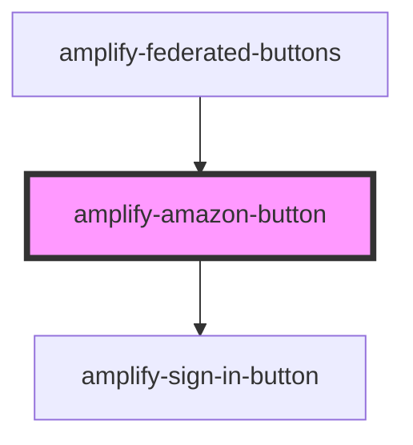

# amplify-amazon-button

<!-- Auto Generated Below -->

## Properties

| Property                | Attribute   | Description                                                                                                                     | Type                                                | Default     |
| ----------------------- | ----------- | ------------------------------------------------------------------------------------------------------------------------------- | --------------------------------------------------- | ----------- |
| `clientId`              | `client-id` | App-specific client ID from Google                                                                                              | `string`                                            | `undefined` |
| `handleAuthStateChange` | --          | Passed from the Authenticatior component in order to change Authentication state e.g. SignIn -> 'Create Account' link -> SignUp | `(nextAuthState: AuthState, data?: object) => void` | `undefined` |

## Dependencies

### Used by

 - [amplify-federated-buttons](../amplify-federated-buttons)

### Depends on

- [amplify-sign-in-button](../amplify-sign-in-button)

### Graph

----------------------------------------------

*Built with [StencilJS](https://stenciljs.com/)*
