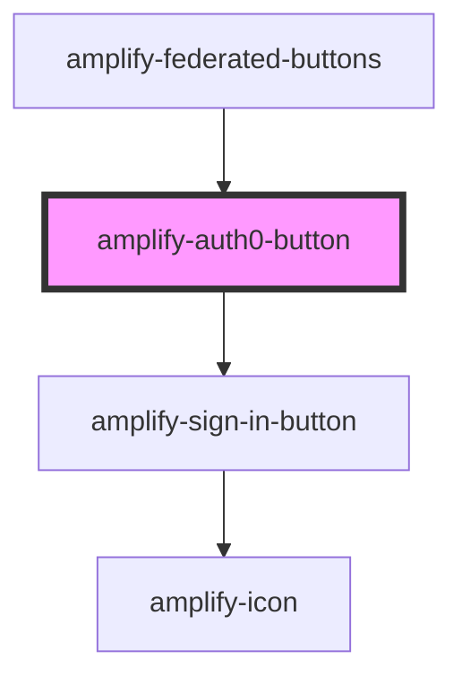

# amplify-auth0-button

<!-- Auto Generated Below -->

## Properties

| Property                | Attribute | Description                                                           | Type                                                                                                                                     | Default                        |
| ----------------------- | --------- | --------------------------------------------------------------------- | ---------------------------------------------------------------------------------------------------------------------------------------- | ------------------------------ |
| `config`                | --        | See: https://auth0.com/docs/libraries/auth0js/v9#available-parameters | `{ audience?: string; clientID: string; domain: string; responseType: string; redirectUri: string; returnTo?: string; scope?: string; }` | `undefined`                    |
| `handleAuthStateChange` | --        | Auth state change handler for this component                          | `(nextAuthState: AuthState, data?: object) => void`                                                                                      | `dispatchAuthStateChangeEvent` |

## Dependencies

### Used by

 - [amplify-federated-buttons](../amplify-federated-buttons)

### Depends on

- [amplify-sign-in-button](../amplify-sign-in-button)

### Graph

----------------------------------------------

*Built with [StencilJS](https://stenciljs.com/)*
