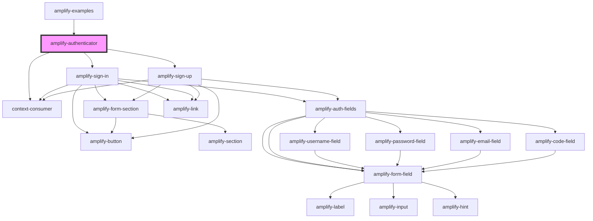

# amplify-authenticator

<!-- Auto Generated Below -->

## Properties

| Property           | Attribute            | Description                                                                                                                     | Type                                                                                                                                                                                                                                                                                                                                                                                                                                                               | Default            |
| ------------------ | -------------------- | ------------------------------------------------------------------------------------------------------------------------------- | ------------------------------------------------------------------------------------------------------------------------------------------------------------------------------------------------------------------------------------------------------------------------------------------------------------------------------------------------------------------------------------------------------------------------------------------------------------------ | ------------------ |
| `initialAuthState` | `initial-auth-state` | Initial starting state of the Authenticator component. E.g. If `signup` is passed the default component is set to AmplifySignUp | `AuthState.ConfirmSignIn \| AuthState.ConfirmSignUp \| AuthState.CustomConfirmSignIn \| AuthState.ForgotPassword \| AuthState.Loading \| AuthState.ResetPassword \| AuthState.SignIn \| AuthState.SignOut \| AuthState.SignUp \| AuthState.TOTPSetup \| AuthState.confirmingSignInCustomFlow \| AuthState.confirmingSignUpCustomFlow \| AuthState.settingMFA \| AuthState.signedIn \| AuthState.signedOut \| AuthState.signingUp \| AuthState.verifyingAttributes` | `AuthState.SignIn` |

## Dependencies

### Used by

 - [amplify-examples](../amplify-examples)

### Depends on

- [amplify-sign-in](../amplify-sign-in)
- [amplify-sign-up](../amplify-sign-up)
- context-consumer

### Graph

----------------------------------------------

*Built with [StencilJS](https://stenciljs.com/)*
