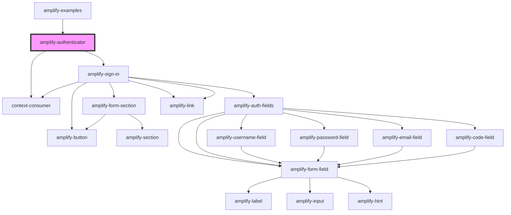

# amplify-authenticator

<!-- Auto Generated Below -->

## Properties

| Property | Attribute | Description | Type     | Default     |
| -------- | --------- | ----------- | -------- | ----------- |
| `state`  | `state`   |             | `string` | `'loading'` |

## Dependencies

### Used by

 - [amplify-examples](../amplify-examples)

### Depends on

- [amplify-sign-in](../amplify-sign-in)
- context-consumer

### Graph

----------------------------------------------

*Built with [StencilJS](https://stenciljs.com/)*
