# amplify-authenticator

<!-- Auto Generated Below -->

## Properties

| Property           | Attribute            | Description                                                                                                                     | Type                                                                                                                                                                                                                                                                                                                                                                                                                                                                                          | Default            |
| ------------------ | -------------------- | ------------------------------------------------------------------------------------------------------------------------------- | --------------------------------------------------------------------------------------------------------------------------------------------------------------------------------------------------------------------------------------------------------------------------------------------------------------------------------------------------------------------------------------------------------------------------------------------------------------------------------------------- | ------------------ |
| `federated`        | --                   | Federated credentials & configuration.                                                                                          | `FederatedConfig`                                                                                                                                                                                                                                                                                                                                                                                                                                                                             | `undefined`        |
| `initialAuthState` | `initial-auth-state` | Initial starting state of the Authenticator component. E.g. If `signup` is passed the default component is set to AmplifySignUp | `AuthState.ConfirmSignIn \| AuthState.ConfirmSignUp \| AuthState.CustomConfirmSignIn \| AuthState.ForgotPassword \| AuthState.Loading \| AuthState.ResetPassword \| AuthState.SettingMFA \| AuthState.SignIn \| AuthState.SignOut \| AuthState.SignUp \| AuthState.SignedIn \| AuthState.SignedOut \| AuthState.SigningUp \| AuthState.TOTPSetup \| AuthState.VerifyContact \| AuthState.VerifyingAttributes \| AuthState.confirmingSignInCustomFlow \| AuthState.confirmingSignUpCustomFlow` | `AuthState.SignIn` |

## Dependencies

### Used by

 - [amplify-examples](../amplify-examples)

### Depends on

- [amplify-sign-in](../amplify-sign-in)
- [amplify-confirm-sign-in](../amplify-confirm-sign-in)
- [amplify-sign-up](../amplify-sign-up)
- [amplify-confirm-sign-up](../amplify-confirm-sign-up)
- [amplify-forgot-password](../amplify-forgot-password)
- [amplify-require-new-password](../amplify-require-new-password)
- [amplify-verify-contact](../amplify-verify-contact)
- [amplify-totp-setup](../amplify-totp-setup)
- [amplify-greetings](../amplify-greetings)

### Graph

```mermaid
graph TD;
  amplify-authenticator --> amplify-sign-in
  amplify-authenticator --> amplify-confirm-sign-in
  amplify-authenticator --> amplify-sign-up
  amplify-authenticator --> amplify-confirm-sign-up
  amplify-authenticator --> amplify-forgot-password
  amplify-authenticator --> amplify-require-new-password
  amplify-authenticator --> amplify-verify-contact
  amplify-authenticator --> amplify-totp-setup
  amplify-authenticator --> amplify-greetings
  amplify-sign-in --> amplify-link
  amplify-sign-in --> amplify-form-section
  amplify-sign-in --> amplify-federated-buttons
  amplify-sign-in --> amplify-strike
  amplify-sign-in --> amplify-auth-fields
  amplify-form-section --> amplify-button
  amplify-form-section --> amplify-section
  amplify-federated-buttons --> amplify-google-button
  amplify-federated-buttons --> amplify-facebook-button
  amplify-federated-buttons --> amplify-amazon-button
  amplify-federated-buttons --> amplify-oauth-button
  amplify-federated-buttons --> amplify-auth0-button
  amplify-google-button --> amplify-sign-in-button
  amplify-sign-in-button --> amplify-icon
  amplify-facebook-button --> amplify-sign-in-button
  amplify-amazon-button --> amplify-sign-in-button
  amplify-oauth-button --> amplify-sign-in-button
  amplify-auth0-button --> amplify-sign-in-button
  amplify-auth-fields --> amplify-username-field
  amplify-auth-fields --> amplify-password-field
  amplify-auth-fields --> amplify-email-field
  amplify-auth-fields --> amplify-code-field
  amplify-auth-fields --> amplify-phone-field
  amplify-auth-fields --> amplify-form-field
  amplify-username-field --> amplify-form-field
  amplify-form-field --> amplify-label
  amplify-form-field --> amplify-input
  amplify-form-field --> amplify-hint
  amplify-password-field --> amplify-form-field
  amplify-email-field --> amplify-form-field
  amplify-code-field --> amplify-form-field
  amplify-phone-field --> amplify-form-field
  amplify-phone-field --> amplify-country-dial-code
  amplify-phone-field --> amplify-input
  amplify-country-dial-code --> amplify-select
  amplify-confirm-sign-in --> amplify-form-section
  amplify-confirm-sign-in --> amplify-link
  amplify-confirm-sign-in --> amplify-auth-fields
  amplify-sign-up --> amplify-form-section
  amplify-sign-up --> amplify-auth-fields
  amplify-sign-up --> amplify-link
  amplify-sign-up --> amplify-button
  amplify-confirm-sign-up --> amplify-link
  amplify-confirm-sign-up --> amplify-form-section
  amplify-confirm-sign-up --> amplify-auth-fields
  amplify-forgot-password --> amplify-form-section
  amplify-forgot-password --> amplify-link
  amplify-forgot-password --> amplify-auth-fields
  amplify-require-new-password --> amplify-form-section
  amplify-require-new-password --> amplify-link
  amplify-require-new-password --> amplify-auth-fields
  amplify-verify-contact --> amplify-input
  amplify-verify-contact --> amplify-radio-button
  amplify-verify-contact --> amplify-form-section
  amplify-verify-contact --> amplify-link
  amplify-radio-button --> amplify-label
  amplify-totp-setup --> amplify-form-section
  amplify-totp-setup --> amplify-form-field
  amplify-greetings --> amplify-nav
  amplify-greetings --> amplify-sign-out
  amplify-sign-out --> amplify-button
  amplify-examples --> amplify-authenticator
  style amplify-authenticator fill:#f9f,stroke:#333,stroke-width:4px
```

----------------------------------------------

*Built with [StencilJS](https://stenciljs.com/)*
