# amplify-authenticator

<!-- Auto Generated Below -->

## Properties

| Property                | Attribute            | Description                                                                                                                     | Type                                                               | Default            |
| ----------------------- | -------------------- | ------------------------------------------------------------------------------------------------------------------------------- | ------------------------------------------------------------------ | ------------------ |
| `federated`             | --                   | Federated credentials & configuration.                                                                                          | `FederatedConfig`                                                  | `undefined`        |
| `handleAuthStateChange` | --                   | Callback for Authenticator state machine changes                                                                                | `(nextAuthState: AuthState, data?: object) => void`                | `() => {}`         |
| `hideToast`             | `hide-toast`         | Hide amplify-toast for auth errors                                                                                              | `boolean`                                                          | `false`            |
| `initialAuthState`      | `initial-auth-state` | Initial starting state of the Authenticator component. E.g. If `signup` is passed the default component is set to AmplifySignUp | `AuthState.ForgotPassword \| AuthState.SignIn \| AuthState.SignUp` | `AuthState.SignIn` |
| `usernameAlias`         | `username-alias`     | Username Alias is used to setup authentication with `username`, `email` or `phone_number`                                       | `"email" \| "phone_number" \| "username"`                          | `undefined`        |

## Slots

| Slot                     | Description                                                                                                            |
| ------------------------ | ---------------------------------------------------------------------------------------------------------------------- |
| `"confirm-sign-in"`      | Content placed inside of the confirm sign in workflow for when a user needs to confirm the account they signed in with |
| `"confirm-sign-up"`      | Content placed inside of the confirm sign up workflow for when a user needs to confirm the account they signed up with |
| `"forgot-password"`      | Content placed inside of the forgot password workflow for when a user wants to reset their password                    |
| `"greetings"`            | Content placed inside of the greetings navigation for when a user is signed in                                         |
| `"loading"`              | Content placed inside of the loading workflow for when the app is loading                                              |
| `"require-new-password"` | Content placed inside of the require new password workflow for when a user is required to update their password        |
| `"sign-in"`              | Content placed inside of the sign in workflow for when a user wants to sign into their account                         |
| `"sign-up"`              | Content placed inside of the sign up workflow for when a user wants to register a new account                          |
| `"totp-setup"`           | Content placed inside of the totp-setup workflow for when a user opts to use TOTP MFA                                  |
| `"verify-contact"`       | Content placed inside of the verify-contact workflow for when a user must verify their contact information             |

## CSS Custom Properties

| Name                  | Description                                        |
| --------------------- | -------------------------------------------------- |
| `--background-color`  | Background color of the container                  |
| `--border-radius`     | Border radius of the container                     |
| `--box-shadow`        | Bow shadow of the container                        |
| `--container-align`   | `align-items` property of a flex container         |
| `--container-display` | Display option of the container. Defaults to flex. |
| `--container-height`  | Height of the container. Defaults to 100vh.        |
| `--container-justify` | `justify-content` property of a flex container     |
| `--margin-bottom`     | Margin below the component                         |
| `--min-width`         | Minimum width of the container                     |
| `--padding`           | Padding within the component                       |
| `--width`             | Width of the container                             |

## Dependencies

### Depends on

- [amplify-sign-in](../amplify-sign-in)
- [amplify-confirm-sign-in](../amplify-confirm-sign-in)
- [amplify-sign-up](../amplify-sign-up)
- [amplify-confirm-sign-up](../amplify-confirm-sign-up)
- [amplify-forgot-password](../amplify-forgot-password)
- [amplify-require-new-password](../amplify-require-new-password)
- [amplify-verify-contact](../amplify-verify-contact)
- [amplify-totp-setup](../amplify-totp-setup)
- [amplify-toast](../amplify-toast)

### Graph

```mermaid
graph TD;
  amplify-authenticator --> amplify-sign-in
  amplify-authenticator --> amplify-confirm-sign-in
  amplify-authenticator --> amplify-sign-up
  amplify-authenticator --> amplify-confirm-sign-up
  amplify-authenticator --> amplify-forgot-password
  amplify-authenticator --> amplify-require-new-password
  amplify-authenticator --> amplify-verify-contact
  amplify-authenticator --> amplify-totp-setup
  amplify-authenticator --> amplify-toast
  amplify-sign-in --> amplify-button
  amplify-sign-in --> amplify-form-section
  amplify-sign-in --> amplify-federated-buttons
  amplify-sign-in --> amplify-strike
  amplify-sign-in --> amplify-auth-fields
  amplify-sign-in --> amplify-loading-spinner
  amplify-button --> amplify-icon
  amplify-form-section --> amplify-section
  amplify-form-section --> amplify-button
  amplify-form-section --> amplify-loading-spinner
  amplify-loading-spinner --> amplify-icon
  amplify-federated-buttons --> amplify-google-button
  amplify-federated-buttons --> amplify-facebook-button
  amplify-federated-buttons --> amplify-amazon-button
  amplify-federated-buttons --> amplify-oauth-button
  amplify-federated-buttons --> amplify-auth0-button
  amplify-google-button --> amplify-sign-in-button
  amplify-sign-in-button --> amplify-icon
  amplify-facebook-button --> amplify-sign-in-button
  amplify-amazon-button --> amplify-sign-in-button
  amplify-oauth-button --> amplify-sign-in-button
  amplify-auth0-button --> amplify-sign-in-button
  amplify-auth-fields --> amplify-username-field
  amplify-auth-fields --> amplify-password-field
  amplify-auth-fields --> amplify-email-field
  amplify-auth-fields --> amplify-code-field
  amplify-auth-fields --> amplify-phone-field
  amplify-auth-fields --> amplify-form-field
  amplify-username-field --> amplify-form-field
  amplify-form-field --> amplify-label
  amplify-form-field --> amplify-input
  amplify-form-field --> amplify-hint
  amplify-password-field --> amplify-form-field
  amplify-email-field --> amplify-form-field
  amplify-code-field --> amplify-form-field
  amplify-phone-field --> amplify-form-field
  amplify-phone-field --> amplify-country-dial-code
  amplify-phone-field --> amplify-input
  amplify-country-dial-code --> amplify-select
  amplify-confirm-sign-in --> amplify-form-section
  amplify-confirm-sign-in --> amplify-button
  amplify-confirm-sign-in --> amplify-auth-fields
  amplify-sign-up --> amplify-form-section
  amplify-sign-up --> amplify-auth-fields
  amplify-sign-up --> amplify-button
  amplify-sign-up --> amplify-loading-spinner
  amplify-confirm-sign-up --> amplify-button
  amplify-confirm-sign-up --> amplify-form-section
  amplify-confirm-sign-up --> amplify-auth-fields
  amplify-forgot-password --> amplify-form-section
  amplify-forgot-password --> amplify-button
  amplify-forgot-password --> amplify-auth-fields
  amplify-require-new-password --> amplify-form-section
  amplify-require-new-password --> amplify-button
  amplify-require-new-password --> amplify-auth-fields
  amplify-verify-contact --> amplify-input
  amplify-verify-contact --> amplify-radio-button
  amplify-verify-contact --> amplify-form-section
  amplify-verify-contact --> amplify-button
  amplify-radio-button --> amplify-label
  amplify-totp-setup --> amplify-form-section
  amplify-totp-setup --> amplify-form-field
  amplify-toast --> amplify-icon
  style amplify-authenticator fill:#f9f,stroke:#333,stroke-width:4px
```

----------------------------------------------

*Built with [StencilJS](https://stenciljs.com/)*
