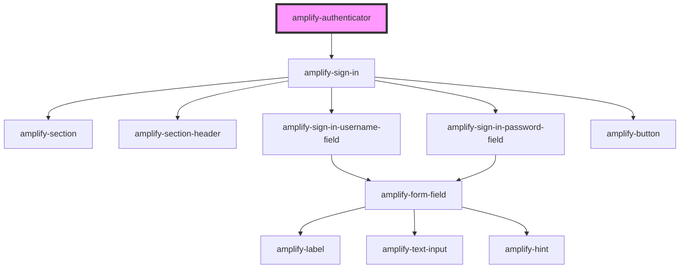

# amplify-authenticator

<!-- Auto Generated Below -->

## Properties

| Property  | Attribute | Description | Type       | Default     |
| --------- | --------- | ----------- | ---------- | ----------- |
| `content` | --        |             | `Function` | `undefined` |
| `signIn`  | --        |             | `Function` | `undefined` |

## Events

| Event             | Description | Type               |
| ----------------- | ----------- | ------------------ |
| `authStateChange` |             | `CustomEvent<any>` |

## Dependencies

### Depends on

- [amplify-sign-in](../amplify-sign-in)

### Graph

----------------------------------------------

*Built with [StencilJS](https://stenciljs.com/)*
