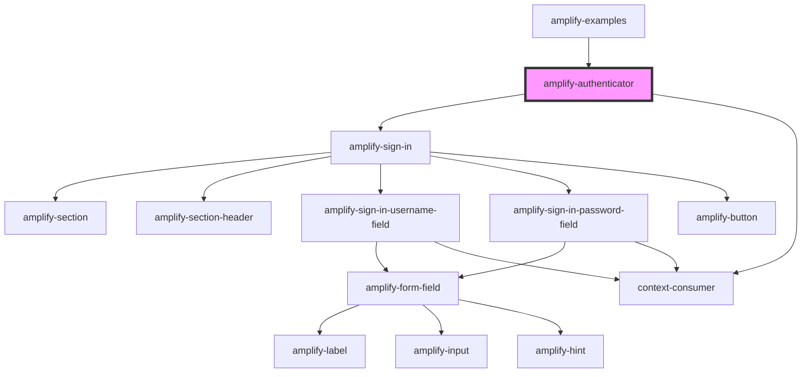

# amplify-authenticator

<!-- Auto Generated Below -->

## Properties

| Property   | Attribute  | Description | Type       | Default     |
| ---------- | ---------- | ----------- | ---------- | ----------- |
| `content`  | --         |             | `Function` | `undefined` |
| `override` | `override` |             | `boolean`  | `false`     |
| `signIn`   | --         |             | `Function` | `undefined` |

## Events

| Event             | Description | Type               |
| ----------------- | ----------- | ------------------ |
| `authStateChange` |             | `CustomEvent<any>` |

## Dependencies

### Used by

 - [amplify-examples](../amplify-examples)

### Depends on

- [amplify-sign-in](../amplify-sign-in)
- context-consumer

### Graph

----------------------------------------------

*Built with [StencilJS](https://stenciljs.com/)*
