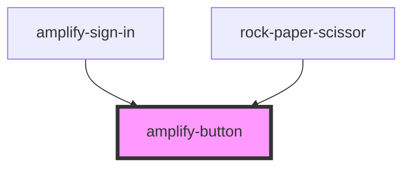

# amplify-button

<!-- Auto Generated Below -->

## Properties

| Property | Attribute | Description | Type     | Default    |
| -------- | --------- | ----------- | -------- | ---------- |
| `role`   | `role`    |             | `string` | `'button'` |
| `type`   | `type`    |             | `string` | `'button'` |

## Dependencies

### Used by

 - [amplify-sign-in](../amplify-sign-in)
 - [rock-paper-scissor](../amplify-examples/rock-paper-scissor)

### Graph

----------------------------------------------

*Built with [StencilJS](https://stenciljs.com/)*
