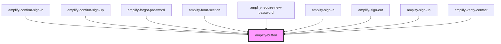

# amplify-button

<!-- Auto Generated Below -->

## Properties

| Property            | Attribute  | Description                                                 | Type                              | Default     |
| ------------------- | ---------- | ----------------------------------------------------------- | --------------------------------- | ----------- |
| `disabled`          | `disabled` | Disabled state of the button                                | `boolean`                         | `false`     |
| `handleButtonClick` | --         | (Optional) Callback called when a user clicks on the button | `(evt: Event) => void`            | `undefined` |
| `type`              | `type`     | Type of the button: 'button', 'submit' or 'reset'           | `"button" \| "reset" \| "submit"` | `'button'`  |
| `variant`           | `variant`  | Variant of a button: 'button' \| 'anchor'                   | `"anchor" \| "button"`            | `'button'`  |

## Dependencies

### Used by

 - [amplify-confirm-sign-in](../amplify-confirm-sign-in)
 - [amplify-confirm-sign-up](../amplify-confirm-sign-up)
 - [amplify-forgot-password](../amplify-forgot-password)
 - [amplify-form-section](../amplify-form-section)
 - [amplify-require-new-password](../amplify-require-new-password)
 - [amplify-sign-in](../amplify-sign-in)
 - [amplify-sign-out](../amplify-sign-out)
 - [amplify-sign-up](../amplify-sign-up)
 - [amplify-verify-contact](../amplify-verify-contact)

### Graph

----------------------------------------------

*Built with [StencilJS](https://stenciljs.com/)*
