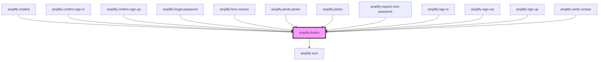

# amplify-button

<!-- Auto Generated Below -->

## Properties

| Property            | Attribute  | Description                                                 | Type                                                                                                                                                                                                                 | Default     |
| ------------------- | ---------- | ----------------------------------------------------------- | -------------------------------------------------------------------------------------------------------------------------------------------------------------------------------------------------------------------- | ----------- |
| `disabled`          | `disabled` | Disabled state of the button                                | `boolean`                                                                                                                                                                                                            | `false`     |
| `handleButtonClick` | --         | (Optional) Callback called when a user clicks on the button | `(evt: Event) => void`                                                                                                                                                                                               | `undefined` |
| `icon`              | `icon`     | Name of icon to be placed inside the button                 | `"amazon" \| "auth0" \| "ban" \| "enter-vr" \| "exit-vr" \| "facebook" \| "google" \| "loading" \| "maximize" \| "microphone" \| "minimize" \| "photoPlaceholder" \| "send" \| "sound" \| "sound-mute" \| "warning"` | `undefined` |
| `type`              | `type`     | Type of the button: 'button', 'submit' or 'reset'           | `"button" \| "reset" \| "submit"`                                                                                                                                                                                    | `'button'`  |
| `variant`           | `variant`  | Variant of a button: 'button' \| 'anchor \| 'icon'          | `"anchor" \| "button" \| "icon"`                                                                                                                                                                                     | `'button'`  |

## Slots

| Slot          | Description                      |
| ------------- | -------------------------------- |
| `"(default)"` | content placed within the button |

## CSS Custom Properties

| Name                         | Description                                              |
| ---------------------------- | -------------------------------------------------------- |
| `--background-color`         | Background color of the button                           |
| `--background-color-active`  | Background color of the button when it's active          |
| `--background-color-disable` | Background color of the button when it's disabled        |
| `--border-color`             | Border color of the button                               |
| `--border-radius`            | Border radius of the button                              |
| `--border-style`             | Border style of the button                               |
| `--border-width`             | Border width of the button                               |
| `--color`                    | Text color within the button                             |
| `--icon-fill`                | Icon fill color within an icon variant button            |
| `--icon-height`              | Icon height within an icon variant button                |
| `--link-active`              | Text color within the anchor variant button when active  |
| `--link-color`               | Text color within an anchor variant button               |
| `--link-hover`               | Text color within an anchor variant button when hovering |
| `--padding`                  | Padding within the button                                |
| `--text-transform`           | Text capitalization transform within the button          |
| `--width`                    | Width of the button                                      |

## Dependencies

### Used by

 - [amplify-chatbot](../amplify-chatbot)
 - [amplify-confirm-sign-in](../amplify-confirm-sign-in)
 - [amplify-confirm-sign-up](../amplify-confirm-sign-up)
 - [amplify-forgot-password](../amplify-forgot-password)
 - [amplify-form-section](../amplify-form-section)
 - [amplify-photo-picker](../amplify-photo-picker)
 - [amplify-picker](../amplify-picker)
 - [amplify-require-new-password](../amplify-require-new-password)
 - [amplify-sign-in](../amplify-sign-in)
 - [amplify-sign-out](../amplify-sign-out)
 - [amplify-sign-up](../amplify-sign-up)
 - [amplify-verify-contact](../amplify-verify-contact)

### Depends on

- [amplify-icon](../amplify-icon)

### Graph

----------------------------------------------

*Built with [StencilJS](https://stenciljs.com/)*
