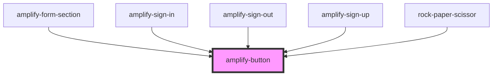

# amplify-button

<!-- Auto Generated Below -->

## Properties

| Property            | Attribute        | Description                                                 | Type                              | Default     |
| ------------------- | ---------------- | ----------------------------------------------------------- | --------------------------------- | ----------- |
| `handleButtonClick` | --               | (Optional) Callback called when a user clicks on the button | `(evt: Event) => void`            | `undefined` |
| `overrideStyle`     | `override-style` | (Optional) Override default styling                         | `boolean`                         | `false`     |
| `type`              | `type`           | Type of the button: 'button', 'submit' or 'reset'           | `"button" \| "reset" \| "submit"` | `'button'`  |

## Dependencies

### Used by

- [amplify-form-section](../amplify-form-section)
- [amplify-sign-in](../amplify-sign-in)
- [amplify-sign-out](../amplify-sign-out)
- [amplify-sign-up](../amplify-sign-up)
- [rock-paper-scissor](../amplify-examples/rock-paper-scissor)

### Graph

---

_Built with [StencilJS](https://stenciljs.com/)_
