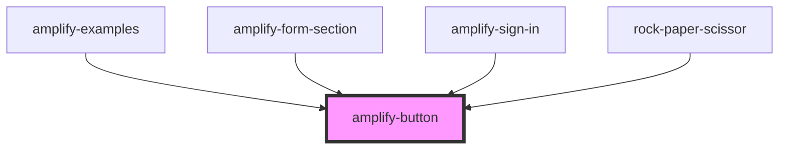

# amplify-button

<!-- Auto Generated Below -->

## Properties

| Property        | Attribute        | Description                                                 | Type                              | Default     |
| --------------- | ---------------- | ----------------------------------------------------------- | --------------------------------- | ----------- |
| `onButtonClick` | --               | (Optional) Callback called when a user clicks on the button | `(evt: Event) => void`            | `undefined` |
| `overrideStyle` | `override-style` | (Optional) Override default styling                         | `boolean`                         | `false`     |
| `type`          | `type`           | Type of the button: 'button', 'submit' or 'reset'           | `"button" \| "reset" \| "submit"` | `'button'`  |

## Dependencies

### Used by

 - [amplify-examples](../amplify-examples)
 - [amplify-form-section](../amplify-form-section)
 - [amplify-sign-in](../amplify-sign-in)
 - [rock-paper-scissor](../amplify-examples/rock-paper-scissor)

### Graph

----------------------------------------------

*Built with [StencilJS](https://stenciljs.com/)*
