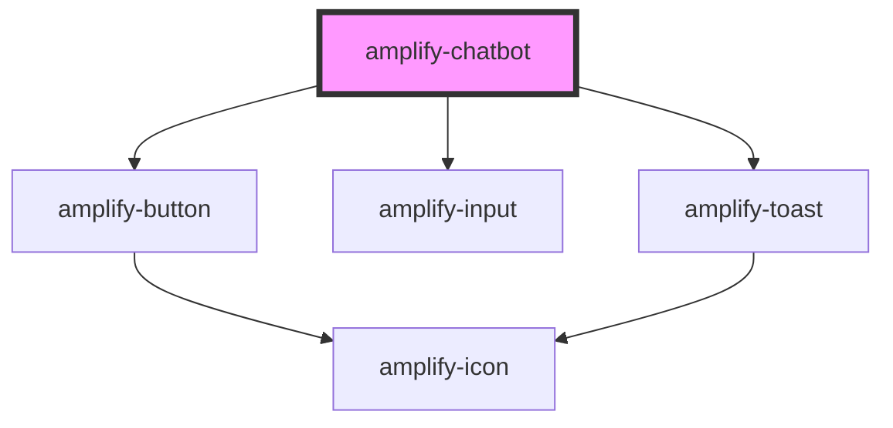

# amplify-chatbot

<!-- Auto Generated Below -->

## Properties

| Property             | Attribute              | Description                                             | Type      | Default         |
| -------------------- | ---------------------- | ------------------------------------------------------- | --------- | --------------- |
| `botName`            | `bot-name`             | Name of the bot                                         | `string`  | `undefined`     |
| `botTitle`           | `bot-title`            | Text placed in the top header                           | `string`  | `'ChatBot Lex'` |
| `clearOnComplete`    | `clear-on-complete`    | Clear messages when conversation finishes               | `boolean` | `false`         |
| `conversationModeOn` | `conversation-mode-on` | Continue listening to users after they send the message | `boolean` | `false`         |
| `textEnabled`        | `text-enabled`         | Whether text chat is enabled                            | `boolean` | `true`          |
| `voiceEnabled`       | `voice-enabled`        | Whether voice chat is enabled                           | `boolean` | `false`         |
| `welcomeMessage`     | `welcome-message`      | Greeting message displayed to users                     | `string`  | `undefined`     |

## Events

| Event           | Description                                  | Type                      |
| --------------- | -------------------------------------------- | ------------------------- |
| `chatCompleted` | Event emitted when conversation is completed | `CustomEvent<ChatResult>` |

## Dependencies

### Depends on

- [amplify-button](../amplify-button)
- [amplify-input](../amplify-input)
- [amplify-toast](../amplify-toast)

### Graph

----------------------------------------------

*Built with [StencilJS](https://stenciljs.com/)*
