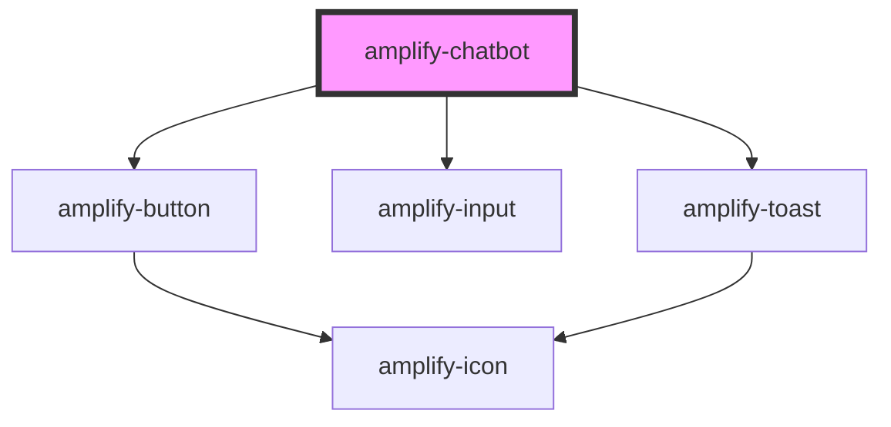

# amplify-chatbot

<!-- Auto Generated Below -->

## Properties

| Property             | Attribute              | Description                                                               | Type      | Default                      |
| -------------------- | ---------------------- | ------------------------------------------------------------------------- | --------- | ---------------------------- |
| `botName`            | `bot-name`             | Name of the bot                                                           | `string`  | `undefined`                  |
| `botTitle`           | `bot-title`            | Text placed in the top header                                             | `string`  | `Translations.CHATBOT_TITLE` |
| `clearOnComplete`    | `clear-on-complete`    | Clear messages when conversation finishes                                 | `boolean` | `false`                      |
| `conversationModeOn` | `conversation-mode-on` | Continue listening to users after they send the message                   | `boolean` | `false`                      |
| `silenceThreshold`   | `silence-threshold`    | Noise threshold between -1 and 1. Anything below is considered a silence. | `number`  | `0.2`                        |
| `silenceTime`        | `silence-time`         | Amount of silence (in ms) to wait for                                     | `number`  | `1500`                       |
| `textEnabled`        | `text-enabled`         | Whether text chat is enabled                                              | `boolean` | `true`                       |
| `voiceEnabled`       | `voice-enabled`        | Whether voice chat is enabled                                             | `boolean` | `false`                      |
| `welcomeMessage`     | `welcome-message`      | Greeting message displayed to users                                       | `string`  | `undefined`                  |

## Events

| Event           | Description                                  | Type                      |
| --------------- | -------------------------------------------- | ------------------------- |
| `chatCompleted` | Event emitted when conversation is completed | `CustomEvent<ChatResult>` |

## Slots

| Slot       | Description                     |
| ---------- | ------------------------------- |
| `"header"` | Title content placed at the top |

## CSS Custom Properties

| Name                      | Description                                  |
| ------------------------- | -------------------------------------------- |
| `--bot-background-color`  | Background color of bot messages             |
| `--bot-dot-color`         | Base color of bot loading message animation  |
| `--bot-text-color`        | Text color of bot messages                   |
| `--header-color`          | Text color within the header                 |
| `--header-size`           | Text size within the header                  |
| `--height`                | Height of the container                      |
| `--user-background-color` | Background color of user messages            |
| `--user-dot-color`        | Base color of user loading message animation |
| `--user-text-color`       | Text color of user messages                  |
| `--width`                 | Width of the container                       |

## Dependencies

### Depends on

- [amplify-button](../amplify-button)
- [amplify-input](../amplify-input)
- [amplify-toast](../amplify-toast)

### Graph

----------------------------------------------

*Built with [StencilJS](https://stenciljs.com/)*
