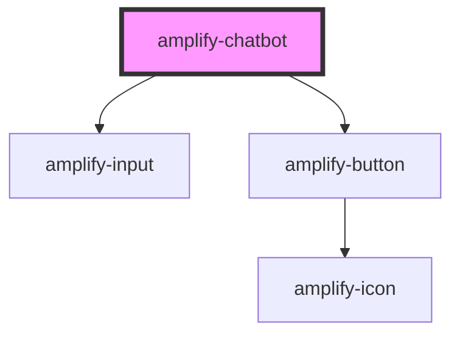

# amplify-chatbot

<!-- Auto Generated Below -->

## Properties

| Property             | Attribute              | Description                                             | Type                                  | Default     |
| -------------------- | ---------------------- | ------------------------------------------------------- | ------------------------------------- | ----------- |
| `botName`            | `bot-name`             | Name of the bot                                         | `string`                              | `undefined` |
| `botTitle`           | `bot-title`            | Text placed in the top header                           | `string`                              | `undefined` |
| `clearOnComplete`    | `clear-on-complete`    | Clear messages when conversation finishes               | `boolean`                             | `false`     |
| `conversationModeOn` | `conversation-mode-on` | Continue listening to users after they send the message | `boolean`                             | `false`     |
| `onComplete`         | --                     | Callback to be called after conversation finishes       | `(err: string, data: object) => void` | `undefined` |
| `welcomeMessage`     | `welcome-message`      | Greeting message displayed to users                     | `string`                              | `undefined` |

## Dependencies

### Depends on

- [amplify-input](../amplify-input)
- [amplify-button](../amplify-button)

### Graph

----------------------------------------------

*Built with [StencilJS](https://stenciljs.com/)*
