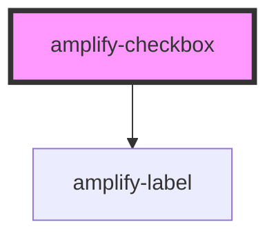

# amplify-checkbox

<!-- Auto Generated Below -->

## Properties

| Property   | Attribute  | Description                                  | Type      | Default     |
| ---------- | ---------- | -------------------------------------------- | --------- | ----------- |
| `checked`  | `checked`  | If `true`, the checkbox is selected.         | `boolean` | `false`     |
| `disabled` | `disabled` | If `true`, the checkbox is disabled          | `boolean` | `false`     |
| `fieldId`  | `field-id` | Field ID used for the 'htmlFor' in the label | `string`  | `undefined` |
| `label`    | `label`    | Label for the checkbox                       | `string`  | `undefined` |
| `name`     | `name`     | Name of the checkbox                         | `string`  | `undefined` |
| `value`    | `value`    | Value of the checkbox                        | `string`  | `undefined` |

## CSS Custom Properties

| Name            | Description      |
| --------------- | ---------------- |
| `--font-family` | Text font family |

## Dependencies

### Depends on

- [amplify-label](../amplify-label)

### Graph

----------------------------------------------

*Built with [StencilJS](https://stenciljs.com/)*
