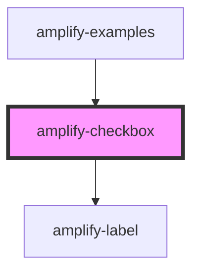

# amplify-checkbox

<!-- Auto Generated Below -->

## Properties

| Property        | Attribute        | Description                                           | Type      | Default      |
| --------------- | ---------------- | ----------------------------------------------------- | --------- | ------------ |
| `fieldId`       | `field-id`       | Field ID used for the 'htmlFor' in the label          | `string`  | `undefined`  |
| `label`         | `label`          | Label for the checkbox                                | `string`  | `undefined`  |
| `name`          | `name`           | Name of the checkbox                                  | `string`  | `undefined`  |
| `styleOverride` | `style-override` | (optional) Whether or not to override default styling | `boolean` | `false`      |
| `type`          | `type`           | Default to checkbox                                   | `string`  | `'checkbox'` |
| `value`         | `value`          | Value of the checkbox                                 | `string`  | `undefined`  |

## Dependencies

### Used by

 - [amplify-examples](../amplify-examples)

### Depends on

- [amplify-label](../amplify-label)

### Graph

----------------------------------------------

*Built with [StencilJS](https://stenciljs.com/)*
