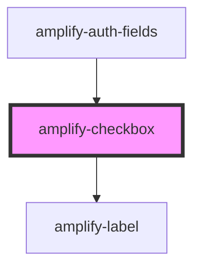

# amplify-checkbox

<!-- Auto Generated Below -->

## Properties

| Property            | Attribute  | Description                                                  | Type                          | Default        |
| ------------------- | ---------- | ------------------------------------------------------------ | ----------------------------- | -------------- |
| `checked`           | `checked`  | If `true`, the checkbox is selected.                         | `boolean`                     | `false`        |
| `disabled`          | `disabled` | If `true`, the checkbox is disabled                          | `boolean`                     | `false`        |
| `fieldId`           | `field-id` | Field ID used for the 'htmlFor' in the label                 | `string`                      | `undefined`    |
| `handleInputChange` | --         | The callback, called when the input is modified by the user. | `(inputEvent: Event) => void` | `() => void 0` |
| `label`             | `label`    | Label for the checkbox                                       | `string`                      | `undefined`    |
| `name`              | `name`     | Name of the checkbox                                         | `string`                      | `undefined`    |
| `value`             | `value`    | Value of the checkbox                                        | `string`                      | `undefined`    |

## Events

| Event        | Description                                                                                        | Type               |
| ------------ | -------------------------------------------------------------------------------------------------- | ------------------ |
| `formSubmit` | Event formSubmit is emitted on keydown 'Enter' on an input and can be listened to by a parent form | `CustomEvent<any>` |

## Dependencies

### Used by

 - [amplify-auth-fields](../amplify-auth-fields)

### Depends on

- [amplify-label](../amplify-label)

### Graph

----------------------------------------------

*Built with [StencilJS](https://stenciljs.com/)*
