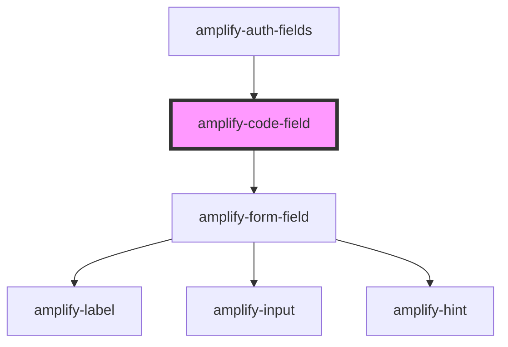

# amplify-code-field

<!-- Auto Generated Below -->

## Properties

| Property            | Attribute     | Description                                                                                                        | Type                                | Default                         |
| ------------------- | ------------- | ------------------------------------------------------------------------------------------------------------------ | ----------------------------------- | ------------------------------- |
| `disabled`          | `disabled`    | Will disable the input if set to true                                                                              | `boolean`                           | `undefined`                     |
| `fieldId`           | `field-id`    | Based on the type of field e.g. sign in, sign up, forgot password, etc.                                            | `string`                            | `CODE_SUFFIX`                   |
| `handleInputChange` | --            | The callback, called when the input is modified by the user.                                                       | `(inputEvent: Event) => void`       | `undefined`                     |
| `hint`              | `hint`        | Used as the hint in case you forgot your confirmation code, etc.                                                   | `FunctionalComponent<{}> \| string` | `undefined`                     |
| `inputProps`        | --            | Attributes places on the input element: https://developer.mozilla.org/en-US/docs/Web/HTML/Element/input#Attributes | `object`                            | `undefined`                     |
| `label`             | `label`       | Used for the code label                                                                                            | `string`                            | `Translations.CODE_LABEL`       |
| `placeholder`       | `placeholder` | Used for the placeholder label                                                                                     | `string`                            | `Translations.CODE_PLACEHOLDER` |
| `required`          | `required`    | The required flag in order to make an input required prior to submitting a form                                    | `boolean`                           | `false`                         |
| `value`             | `value`       | The value of the content inside of the input field                                                                 | `string`                            | `undefined`                     |

## Dependencies

### Used by

 - [amplify-auth-fields](../amplify-auth-fields)

### Depends on

- [amplify-form-field](../amplify-form-field)

### Graph

----------------------------------------------

*Built with [StencilJS](https://stenciljs.com/)*
