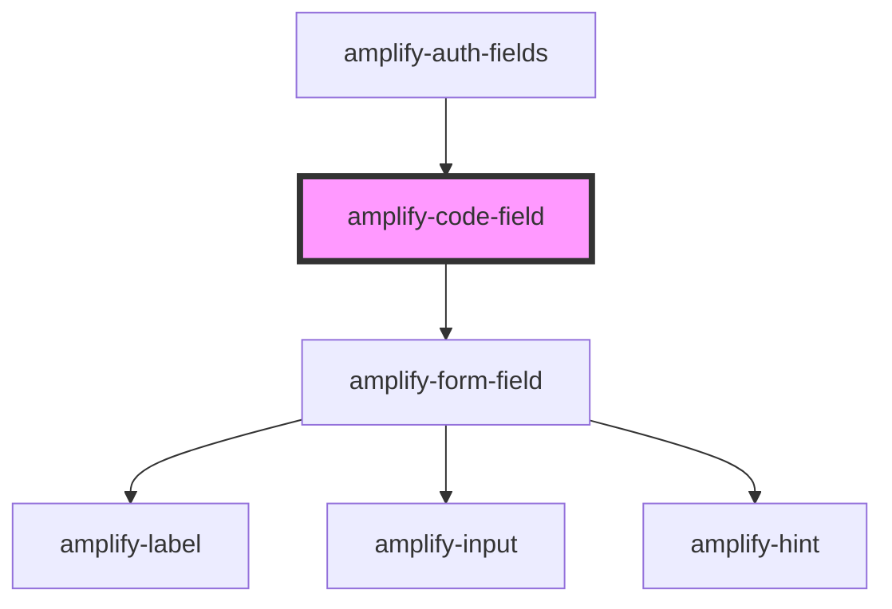

# amplify-code-field

<!-- Auto Generated Below -->

## Properties

| Property      | Attribute     | Description                                                                     | Type      | Default            |
| ------------- | ------------- | ------------------------------------------------------------------------------- | --------- | ------------------ |
| `fieldId`     | `field-id`    | Based on the type of field e.g. sign in, sign up, forgot password, etc.         | `string`  | `CODE_SUFFIX`      |
| `label`       | `label`       | Used for the code label                                                         | `string`  | `CODE_LABEL`       |
| `placeholder` | `placeholder` | Used for the placeholder label                                                  | `string`  | `CODE_PLACEHOLDER` |
| `required`    | `required`    | The required flag in order to make an input required prior to submitting a form | `boolean` | `false`            |

## Dependencies

### Used by

 - [amplify-auth-fields](../amplify-auth-fields)

### Depends on

- [amplify-form-field](../amplify-form-field)

### Graph

----------------------------------------------

*Built with [StencilJS](https://stenciljs.com/)*
