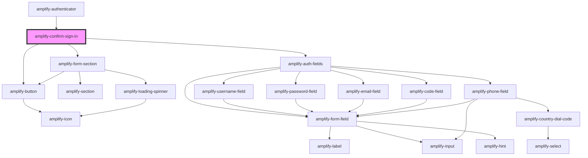

# amplify-sign-in

<!-- Auto Generated Below -->


## Properties

| Property                | Attribute            | Description                                                                                                                                                                                                                                                                                                                                                                                                                                                                                                                           | Type                                                | Default                          |
| ----------------------- | -------------------- | ------------------------------------------------------------------------------------------------------------------------------------------------------------------------------------------------------------------------------------------------------------------------------------------------------------------------------------------------------------------------------------------------------------------------------------------------------------------------------------------------------------------------------------- | --------------------------------------------------- | -------------------------------- |
| `formFields`            | --                   | Form fields allows you to utilize our pre-built components such as username field, code field, password field, email field, etc. by passing an array of strings that you would like the order of the form to be in. If you need more customization, such as changing text for a label or adjust a placeholder, you can follow the structure below in order to do just that. ``` [   {     type: string,     label: string,     placeholder: string,     hint: string \| Functional Component \| null,     required: boolean   } ] ``` | `FormFieldTypes \| string[]`                        | `this.defaultFormFields`         |
| `handleAuthStateChange` | --                   | Auth state change handler for this component                                                                                                                                                                                                                                                                                                                                                                                                                                                                                          | `(nextAuthState: AuthState, data?: object) => void` | `dispatchAuthStateChangeEvent`   |
| `handleSubmit`          | --                   | Fires when confirm sign in form is submitted                                                                                                                                                                                                                                                                                                                                                                                                                                                                                          | `(event: Event) => void`                            | `(event) => this.confirm(event)` |
| `headerText`            | `header-text`        | Used for header text in confirm sign in component                                                                                                                                                                                                                                                                                                                                                                                                                                                                                     | `string`                                            | `Translations.CONFIRM_SMS_CODE`  |
| `submitButtonText`      | `submit-button-text` | Used for the submit button text in confirm sign in component                                                                                                                                                                                                                                                                                                                                                                                                                                                                          | `string`                                            | `Translations.CONFIRM`           |
| `user`                  | --                   | Cognito user signing in                                                                                                                                                                                                                                                                                                                                                                                                                                                                                                               | `CognitoUserInterface`                              | `undefined`                      |


## Dependencies

### Used by

 - [amplify-authenticator](../amplify-authenticator)

### Depends on

- [amplify-form-section](../amplify-form-section)
- [amplify-button](../amplify-button)
- [amplify-auth-fields](../amplify-auth-fields)

### Graph


----------------------------------------------

*Built with [StencilJS](https://stenciljs.com/)*
