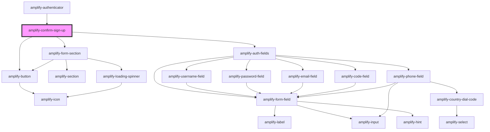

# amplify-sign-up

<!-- Auto Generated Below -->


## Properties

| Property                | Attribute            | Description                                                                                                                                                                                                                                                                                                                                                                                                                                                                                                                           | Type                                                | Default                                           |
| ----------------------- | -------------------- | ------------------------------------------------------------------------------------------------------------------------------------------------------------------------------------------------------------------------------------------------------------------------------------------------------------------------------------------------------------------------------------------------------------------------------------------------------------------------------------------------------------------------------------- | --------------------------------------------------- | ------------------------------------------------- |
| `formFields`            | --                   | Form fields allows you to utilize our pre-built components such as username field, code field, password field, email field, etc. by passing an array of strings that you would like the order of the form to be in. If you need more customization, such as changing text for a label or adjust a placeholder, you can follow the structure below in order to do just that. ``` [   {     type: string,     label: string,     placeholder: string,     hint: string \| Functional Component \| null,     required: boolean   } ] ``` | `FormFieldTypes \| string[]`                        | `[]`                                              |
| `handleAuthStateChange` | --                   | Auth state change handler for this components e.g. SignIn -> 'Create Account' link -> SignUp                                                                                                                                                                                                                                                                                                                                                                                                                                          | `(nextAuthState: AuthState, data?: object) => void` | `dispatchAuthStateChangeEvent`                    |
| `handleSubmit`          | --                   | Fires when sign up form is submitted                                                                                                                                                                                                                                                                                                                                                                                                                                                                                                  | `(submitEvent: Event) => void`                      | `event => 		this.confirmSignUp(event)`            |
| `headerText`            | `header-text`        | Used for header text in confirm sign up component                                                                                                                                                                                                                                                                                                                                                                                                                                                                                     | `string`                                            | `Translations.CONFIRM_SIGN_UP_HEADER_TEXT`        |
| `submitButtonText`      | `submit-button-text` | Used for the submit button text in confirm sign up component                                                                                                                                                                                                                                                                                                                                                                                                                                                                          | `string`                                            | `Translations.CONFIRM_SIGN_UP_SUBMIT_BUTTON_TEXT` |
| `user`                  | --                   | Used for the username to be passed to resend code                                                                                                                                                                                                                                                                                                                                                                                                                                                                                     | `CognitoUserInterface`                              | `undefined`                                       |
| `usernameAlias`         | `username-alias`     | Username Alias is used to setup authentication with `username`, `email` or `phone_number`                                                                                                                                                                                                                                                                                                                                                                                                                                             | `"email" \| "phone_number" \| "username"`           | `'username'`                                      |


## Dependencies

### Used by

 - [amplify-authenticator](../amplify-authenticator)

### Depends on

- [amplify-button](../amplify-button)
- [amplify-form-section](../amplify-form-section)
- [amplify-auth-fields](../amplify-auth-fields)

### Graph


----------------------------------------------

*Built with [StencilJS](https://stenciljs.com/)*
