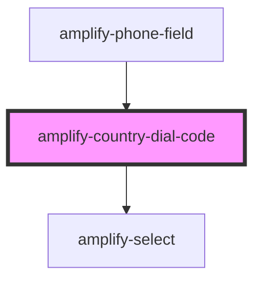

# amplify-country-dial-code

<!-- Auto Generated Below -->

## Properties

| Property            | Attribute   | Description                                                           | Type                          | Default                    |
| ------------------- | ----------- | --------------------------------------------------------------------- | ----------------------------- | -------------------------- |
| `dialCode`          | `dial-code` | Default selected dial code                                            | `number \| string`            | `'+1'`                     |
| `fieldId`           | `field-id`  | The ID of the field.  Should match with its corresponding input's ID. | `string`                      | `COUNTRY_DIAL_CODE_SUFFIX` |
| `handleInputChange` | --          | The callback, called when the input is modified by the user.          | `(inputEvent: Event) => void` | `undefined`                |
| `options`           | --          | The options of the country dial code select input.                    | `CountryCodeDialOptions`      | `countryDialCodes`         |

## Dependencies

### Used by

 - [amplify-phone-field](../amplify-phone-field)

### Depends on

- [amplify-select](../amplify-select)

### Graph

----------------------------------------------

*Built with [StencilJS](https://stenciljs.com/)*
