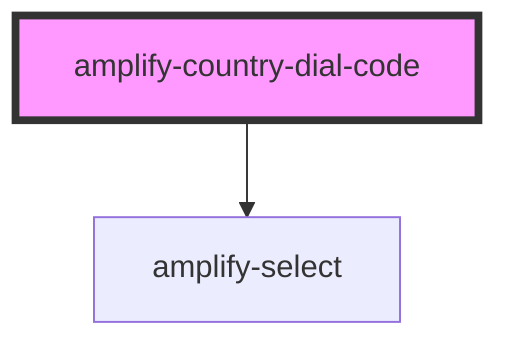

# amplify-country-dial-code

<!-- Auto Generated Below -->

## Properties

| Property        | Attribute        | Description                                        | Type                     | Default            |
| --------------- | ---------------- | -------------------------------------------------- | ------------------------ | ------------------ |
| `options`       | --               | The options of the country dial code select input. | `CountryCodeDialOptions` | `countryDialCodes` |
| `overrideStyle` | `override-style` | (Optional) Overrides default styling               | `boolean`                | `false`            |

## Dependencies

### Depends on

- [amplify-select](../amplify-select)

### Graph

----------------------------------------------

*Built with [StencilJS](https://stenciljs.com/)*
