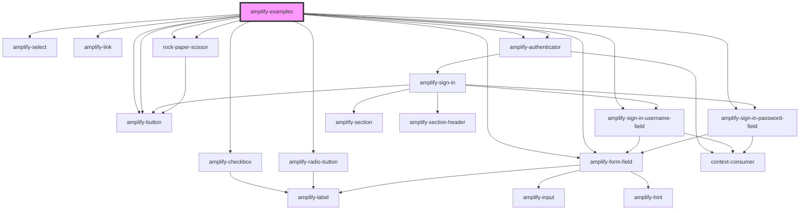

# sample-app

<!-- Auto Generated Below -->

## Dependencies

### Depends on

- [amplify-checkbox](../amplify-checkbox)
- [amplify-radio-button](../amplify-radio-button)
- [amplify-form-field](../amplify-form-field)
- [amplify-form-field](../amplify-form-field)
- [amplify-select](../amplify-select)
- [amplify-button](../amplify-button)
- [amplify-link](../amplify-link)
- [amplify-authenticator](../amplify-authenticator)
- [amplify-sign-in-username-field](../amplify-sign-in-username-field)
- [amplify-sign-in-password-field](../amplify-sign-in-password-field)
- [amplify-button](../amplify-button)
- [amplify-authenticator](../amplify-authenticator)
- [rock-paper-scissor](rock-paper-scissor)
- [rock-paper-scissor](rock-paper-scissor)

### Graph

----------------------------------------------

*Built with [StencilJS](https://stenciljs.com/)*
