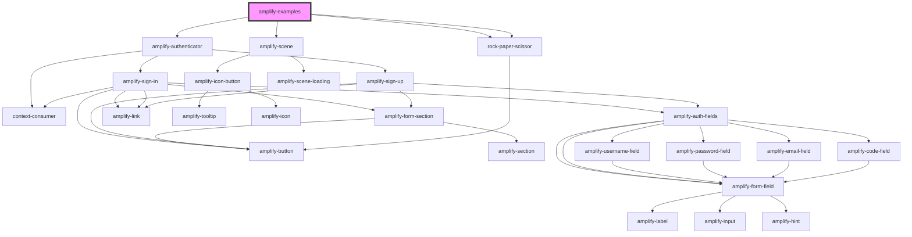

# sample-app

<!-- Auto Generated Below -->

## Dependencies

### Depends on

- [amplify-authenticator](../amplify-authenticator)
- [rock-paper-scissor](rock-paper-scissor)
- [rock-paper-scissor](rock-paper-scissor)
- [amplify-scene](../amplify-scene)

### Graph

----------------------------------------------

*Built with [StencilJS](https://stenciljs.com/)*
