# sample-app

<!-- Auto Generated Below -->

## Dependencies

### Depends on

- [amplify-authenticator](../amplify-authenticator)
- [amplify-authenticator](../amplify-authenticator)
- [amplify-select-mfa-type](../amplify-select-mfa-type)
- [rock-paper-scissor](rock-paper-scissor)
- [rock-paper-scissor](rock-paper-scissor)
- [amplify-scene](../amplify-scene)

### Graph

```mermaid
graph TD;
  amplify-examples --> amplify-authenticator
  amplify-examples --> amplify-authenticator
  amplify-examples --> amplify-select-mfa-type
  amplify-examples --> rock-paper-scissor
  amplify-examples --> rock-paper-scissor
  amplify-examples --> amplify-scene
  amplify-authenticator --> amplify-sign-in
  amplify-authenticator --> amplify-confirm-sign-in
  amplify-authenticator --> amplify-sign-up
  amplify-authenticator --> amplify-confirm-sign-up
  amplify-authenticator --> amplify-forgot-password
  amplify-authenticator --> amplify-require-new-password
  amplify-authenticator --> amplify-verify-contact
  amplify-authenticator --> amplify-totp-setup
  amplify-authenticator --> amplify-greetings
  amplify-sign-in --> amplify-link
  amplify-sign-in --> amplify-form-section
  amplify-sign-in --> amplify-federated-buttons
  amplify-sign-in --> amplify-strike
  amplify-sign-in --> amplify-auth-fields
  amplify-form-section --> amplify-button
  amplify-form-section --> amplify-section
  amplify-federated-buttons --> amplify-google-button
  amplify-federated-buttons --> amplify-facebook-button
  amplify-federated-buttons --> amplify-amazon-button
  amplify-federated-buttons --> amplify-oauth-button
  amplify-federated-buttons --> amplify-auth0-button
  amplify-google-button --> amplify-sign-in-button
  amplify-sign-in-button --> amplify-icon
  amplify-facebook-button --> amplify-sign-in-button
  amplify-amazon-button --> amplify-sign-in-button
  amplify-oauth-button --> amplify-sign-in-button
  amplify-auth0-button --> amplify-sign-in-button
  amplify-auth-fields --> amplify-username-field
  amplify-auth-fields --> amplify-password-field
  amplify-auth-fields --> amplify-email-field
  amplify-auth-fields --> amplify-code-field
  amplify-auth-fields --> amplify-phone-field
  amplify-auth-fields --> amplify-form-field
  amplify-username-field --> amplify-form-field
  amplify-form-field --> amplify-label
  amplify-form-field --> amplify-input
  amplify-form-field --> amplify-hint
  amplify-password-field --> amplify-form-field
  amplify-email-field --> amplify-form-field
  amplify-code-field --> amplify-form-field
  amplify-phone-field --> amplify-form-field
  amplify-phone-field --> amplify-country-dial-code
  amplify-phone-field --> amplify-input
  amplify-country-dial-code --> amplify-select
  amplify-confirm-sign-in --> amplify-form-section
  amplify-confirm-sign-in --> amplify-link
  amplify-confirm-sign-in --> amplify-auth-fields
  amplify-sign-up --> amplify-form-section
  amplify-sign-up --> amplify-auth-fields
  amplify-sign-up --> amplify-link
  amplify-sign-up --> amplify-button
  amplify-confirm-sign-up --> amplify-link
  amplify-confirm-sign-up --> amplify-form-section
  amplify-confirm-sign-up --> amplify-auth-fields
  amplify-forgot-password --> amplify-form-section
  amplify-forgot-password --> amplify-link
  amplify-forgot-password --> amplify-auth-fields
  amplify-require-new-password --> amplify-form-section
  amplify-require-new-password --> amplify-link
  amplify-require-new-password --> amplify-auth-fields
  amplify-verify-contact --> amplify-input
  amplify-verify-contact --> amplify-radio-button
  amplify-verify-contact --> amplify-form-section
  amplify-verify-contact --> amplify-link
  amplify-radio-button --> amplify-label
  amplify-totp-setup --> amplify-form-section
  amplify-totp-setup --> amplify-form-field
  amplify-greetings --> amplify-nav
  amplify-greetings --> amplify-sign-out
  amplify-sign-out --> amplify-button
  amplify-select-mfa-type --> amplify-form-section
  amplify-select-mfa-type --> amplify-radio-button
  amplify-select-mfa-type --> amplify-totp-setup
  rock-paper-scissor --> amplify-button
  amplify-scene --> amplify-icon-button
  amplify-scene --> amplify-scene-loading
  amplify-icon-button --> amplify-tooltip
  amplify-icon-button --> amplify-icon
  style amplify-examples fill:#f9f,stroke:#333,stroke-width:4px
```

----------------------------------------------

*Built with [StencilJS](https://stenciljs.com/)*
