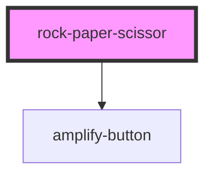

# amplify-button

<!-- Auto Generated Below -->

## Properties

| Property | Attribute | Description | Type       | Default     |
| -------- | --------- | ----------- | ---------- | ----------- |
| `icon`   | --        |             | `Function` | `undefined` |

## Events

| Event    | Description | Type               |
| -------- | ----------- | ------------------ |
| `change` |             | `CustomEvent<any>` |

## Dependencies

### Depends on

- [amplify-button](../../amplify-button)

### Graph

----------------------------------------------

*Built with [StencilJS](https://stenciljs.com/)*
