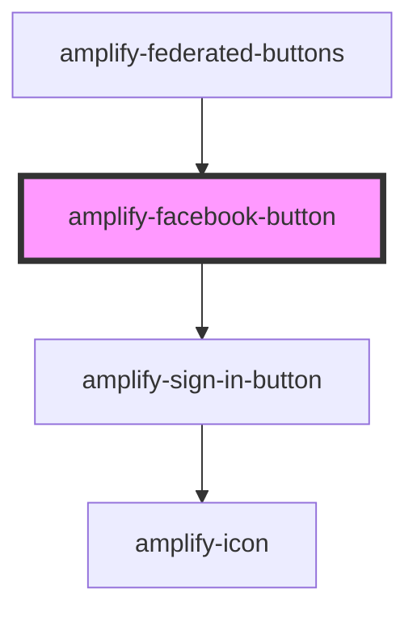

# amplify-facebook-button

<!-- Auto Generated Below -->

## Properties

| Property                | Attribute | Description                                                                                 | Type                                                | Default                        |
| ----------------------- | --------- | ------------------------------------------------------------------------------------------- | --------------------------------------------------- | ------------------------------ |
| `appId`                 | `app-id`  | App-specific client ID from Facebook                                                        | `string`                                            | `undefined`                    |
| `handleAuthStateChange` | --        | Auth state change handler for this component e.g. SignIn -> 'Create Account' link -> SignUp | `(nextAuthState: AuthState, data?: object) => void` | `dispatchAuthStateChangeEvent` |

## Dependencies

### Used by

 - [amplify-federated-buttons](../amplify-federated-buttons)

### Depends on

- [amplify-sign-in-button](../amplify-sign-in-button)

### Graph

----------------------------------------------

*Built with [StencilJS](https://stenciljs.com/)*
