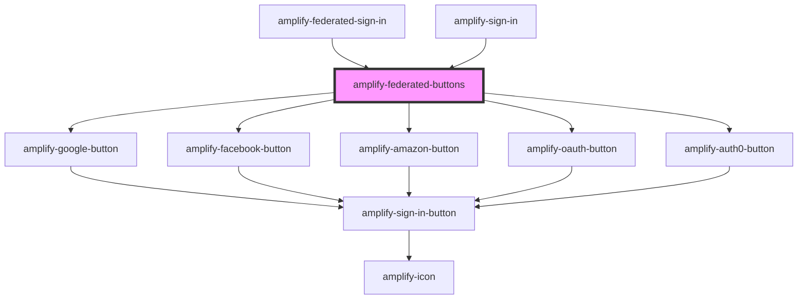

# amplify-federated-buttons

<!-- Auto Generated Below -->

## Properties

| Property                | Attribute    | Description                                                                                 | Type                                                                                                                                                                                                                                                                                                                                                                                                                                                                                          | Default                        |
| ----------------------- | ------------ | ------------------------------------------------------------------------------------------- | --------------------------------------------------------------------------------------------------------------------------------------------------------------------------------------------------------------------------------------------------------------------------------------------------------------------------------------------------------------------------------------------------------------------------------------------------------------------------------------------- | ------------------------------ |
| `authState`             | `auth-state` | The current authentication state.                                                           | `AuthState.ConfirmSignIn \| AuthState.ConfirmSignUp \| AuthState.CustomConfirmSignIn \| AuthState.ForgotPassword \| AuthState.Loading \| AuthState.ResetPassword \| AuthState.SettingMFA \| AuthState.SignIn \| AuthState.SignOut \| AuthState.SignUp \| AuthState.SignedIn \| AuthState.SignedOut \| AuthState.SigningUp \| AuthState.TOTPSetup \| AuthState.VerifyContact \| AuthState.VerifyingAttributes \| AuthState.confirmingSignInCustomFlow \| AuthState.confirmingSignUpCustomFlow` | `AuthState.SignIn`             |
| `federated`             | --           | Federated credentials & configuration.                                                      | `FederatedConfig`                                                                                                                                                                                                                                                                                                                                                                                                                                                                             | `{}`                           |
| `handleAuthStateChange` | --           | Auth state change handler for this component e.g. SignIn -> 'Create Account' link -> SignUp | `(nextAuthState: AuthState, data?: object) => void`                                                                                                                                                                                                                                                                                                                                                                                                                                           | `dispatchAuthStateChangeEvent` |

## Dependencies

### Used by

 - [amplify-federated-sign-in](../amplify-federated-sign-in)
 - [amplify-sign-in](../amplify-sign-in)

### Depends on

- [amplify-google-button](../amplify-google-button)
- [amplify-facebook-button](../amplify-facebook-button)
- [amplify-amazon-button](../amplify-amazon-button)
- [amplify-oauth-button](../amplify-oauth-button)
- [amplify-auth0-button](../amplify-auth0-button)

### Graph

----------------------------------------------

*Built with [StencilJS](https://stenciljs.com/)*
