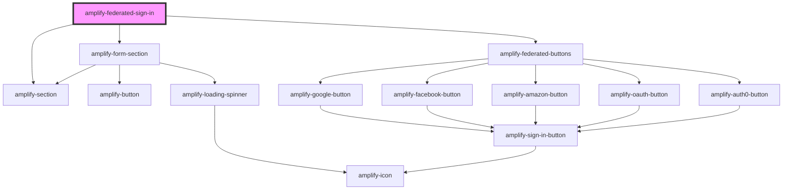

# amplify-federated-sign-in

<!-- Auto Generated Below -->

## Properties

| Property    | Attribute    | Description                            | Type                                                                                                                                                                                                                                                                                                                                                                                                                                                                                          | Default            |
| ----------- | ------------ | -------------------------------------- | --------------------------------------------------------------------------------------------------------------------------------------------------------------------------------------------------------------------------------------------------------------------------------------------------------------------------------------------------------------------------------------------------------------------------------------------------------------------------------------------- | ------------------ |
| `authState` | `auth-state` | The current authentication state.      | `AuthState.ConfirmSignIn or AuthState.ConfirmSignUp or AuthState.CustomConfirmSignIn or AuthState.ForgotPassword or AuthState.Loading or AuthState.ResetPassword or AuthState.SettingMFA or AuthState.SignIn or AuthState.SignOut or AuthState.SignUp or AuthState.SignedIn or AuthState.SignedOut or AuthState.SigningUp or AuthState.TOTPSetup or AuthState.VerifyContact or AuthState.VerifyingAttributes or AuthState.confirmingSignInCustomFlow or AuthState.confirmingSignUpCustomFlow` | `AuthState.SignIn` |
| `federated` | `federated`  | Federated credentials & configuration. | `any`                                                                                                                                                                                                                                                                                                                                                                                                                                                                                         | `{}`               |

## Dependencies

### Depends on

- [amplify-form-section](../amplify-form-section)
- [amplify-section](../amplify-section)
- [amplify-federated-buttons](../amplify-federated-buttons)

### Graph

----------------------------------------------

*Built with [StencilJS](https://stenciljs.com/)*
