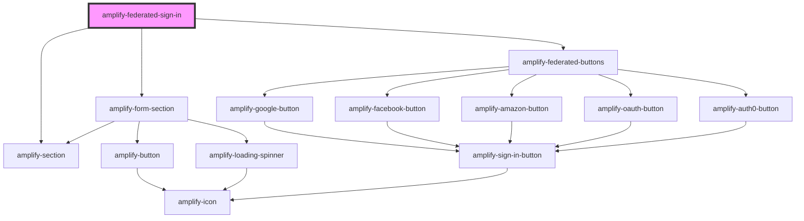

# amplify-federated-sign-in

<!-- Auto Generated Below -->

## Properties

| Property    | Attribute    | Description                            | Type                                                                                                                                                                                                                                                                                                                                                                                                                                                                                          | Default            |
| ----------- | ------------ | -------------------------------------- | --------------------------------------------------------------------------------------------------------------------------------------------------------------------------------------------------------------------------------------------------------------------------------------------------------------------------------------------------------------------------------------------------------------------------------------------------------------------------------------------- | ------------------ |
| `authState` | `auth-state` | The current authentication state.      | `AuthState.ConfirmSignIn \| AuthState.ConfirmSignUp \| AuthState.CustomConfirmSignIn \| AuthState.ForgotPassword \| AuthState.Loading \| AuthState.ResetPassword \| AuthState.SettingMFA \| AuthState.SignIn \| AuthState.SignOut \| AuthState.SignUp \| AuthState.SignedIn \| AuthState.SignedOut \| AuthState.SigningUp \| AuthState.TOTPSetup \| AuthState.VerifyContact \| AuthState.VerifyingAttributes \| AuthState.confirmingSignInCustomFlow \| AuthState.confirmingSignUpCustomFlow` | `AuthState.SignIn` |
| `federated` | `federated`  | Federated credentials & configuration. | `any`                                                                                                                                                                                                                                                                                                                                                                                                                                                                                         | `{}`               |

## Dependencies

### Depends on

- [amplify-form-section](../amplify-form-section)
- [amplify-section](../amplify-section)
- [amplify-federated-buttons](../amplify-federated-buttons)

### Graph

----------------------------------------------

*Built with [StencilJS](https://stenciljs.com/)*
