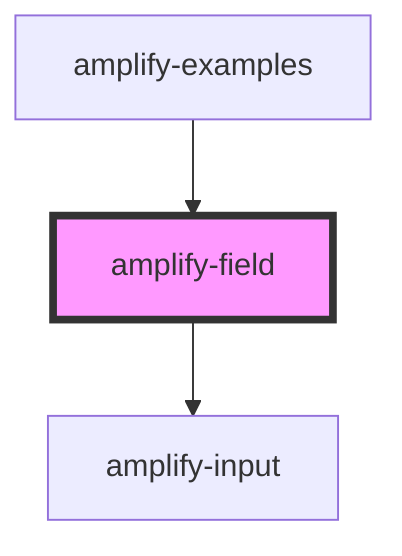

# amplify-field

<!-- Auto Generated Below -->

## Properties

| Property      | Attribute     | Description                                                           | Type                    | Default     |
| ------------- | ------------- | --------------------------------------------------------------------- | ----------------------- | ----------- |
| `description` | `description` | The text of the description.  Goes just below the label.              | `string`                | `undefined` |
| `fieldId`     | `field-id`    | The ID of the field.  Should match with its corresponding input's ID. | `string`                | `undefined` |
| `label`       | `label`       | The text of the label.  Goes above the input. Ex: "First name"        | `string`                | `undefined` |
| `onInput`     | --            | The callback, called when the input is modified by the user.          | `(arg0: Event) => void` | `undefined` |
| `type`        | `type`        | The input type.  Can be any HTML input type.                          | `string`                | `"text"`    |

## Dependencies

### Used by

 - [amplify-examples](../amplify-examples)

### Depends on

- [amplify-input](../amplify-input)

### Graph

----------------------------------------------

*Built with [StencilJS](https://stenciljs.com/)*
