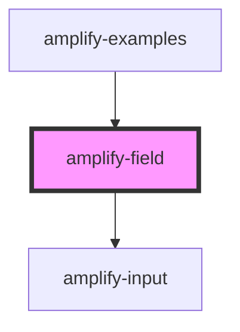

# amplify-field

<!-- Auto Generated Below -->

## Properties

| Property      | Attribute     | Description | Type                    | Default     |
| ------------- | ------------- | ----------- | ----------------------- | ----------- |
| `description` | `description` |             | `string`                | `undefined` |
| `fieldId`     | `field-id`    |             | `string`                | `undefined` |
| `label`       | `label`       |             | `string`                | `undefined` |
| `onInput`     | --            |             | `(arg0: Event) => void` | `undefined` |
| `type`        | `type`        |             | `string`                | `"text"`    |

## Dependencies

### Used by

 - [amplify-examples](../amplify-examples)

### Depends on

- [amplify-input](../amplify-input)

### Graph

----------------------------------------------

*Built with [StencilJS](https://stenciljs.com/)*
