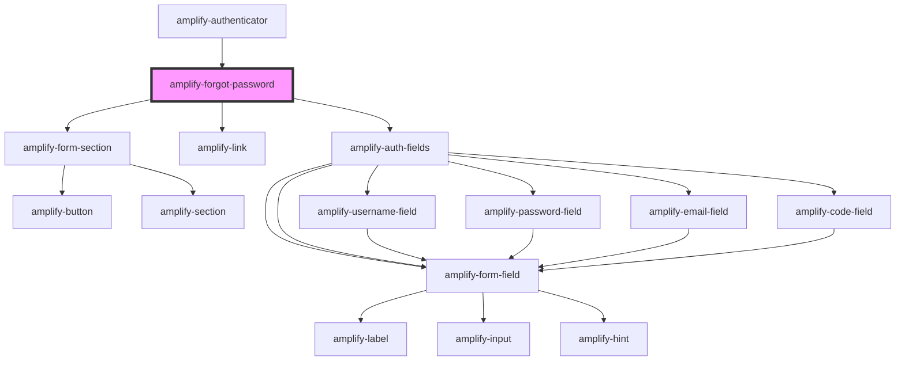

# amplify-forgot-password

<!-- Auto Generated Below -->

## Properties

| Property                | Attribute            | Description | Type                                                | Default                 |
| ----------------------- | -------------------- | ----------- | --------------------------------------------------- | ----------------------- |
| `formFields`            | --                   |             | `FormFieldTypes`                                    | `undefined`             |
| `handleAuthStateChange` | --                   |             | `(nextAuthState: AuthState, data?: object) => void` | `undefined`             |
| `headerText`            | `header-text`        |             | `string`                                            | `'Reset your password'` |
| `overrideStyle`         | `override-style`     |             | `boolean`                                           | `false`                 |
| `submitButtonText`      | `submit-button-text` |             | `string`                                            | `'Send Code'`           |

## Dependencies

### Used by

 - [amplify-authenticator](../amplify-authenticator)

### Depends on

- [amplify-form-section](../amplify-form-section)
- [amplify-link](../amplify-link)
- [amplify-auth-fields](../amplify-auth-fields)

### Graph

----------------------------------------------

*Built with [StencilJS](https://stenciljs.com/)*
