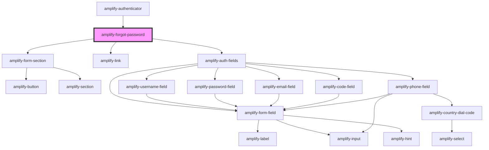

# amplify-forgot-password

<!-- Auto Generated Below -->

## Properties

| Property                | Attribute            | Description                                                                      | Type                                                | Default                       |
| ----------------------- | -------------------- | -------------------------------------------------------------------------------- | --------------------------------------------------- | ----------------------------- |
| `formFields`            | --                   | The form fields displayed inside of the forgot password form                     | `FormFieldTypes`                                    | `undefined`                   |
| `handleAuthStateChange` | --                   | Passed from the Authenticatior component in order to change Authentication state | `(nextAuthState: AuthState, data?: object) => void` | `undefined`                   |
| `handleSend`            | --                   | The function called when making a request to reset password                      | `(event: Event) => void`                            | `event => this.send(event)`   |
| `handleSubmit`          | --                   | The function called when submitting a new password                               | `(event: Event) => void`                            | `event => this.submit(event)` |
| `headerText`            | `header-text`        | The header text of the forgot password section                                   | `string`                                            | `RESET_YOUR_PASSWORD`         |
| `overrideStyle`         | `override-style`     | (Optional) Overrides default styling                                             | `boolean`                                           | `false`                       |
| `submitButtonText`      | `submit-button-text` | The text displayed inside of the submit button for the form                      | `string`                                            | `SEND_CODE`                   |

## Dependencies

### Used by

 - [amplify-authenticator](../amplify-authenticator)

### Depends on

- [amplify-form-section](../amplify-form-section)
- [amplify-link](../amplify-link)
- [amplify-auth-fields](../amplify-auth-fields)

### Graph

----------------------------------------------

*Built with [StencilJS](https://stenciljs.com/)*
