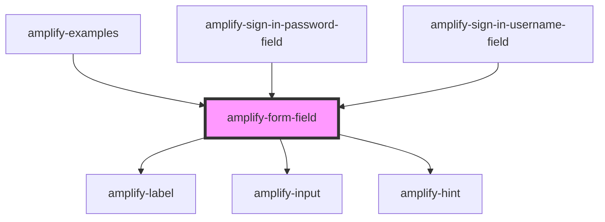

# amplify-form-field

<!-- Auto Generated Below -->

## Properties

| Property        | Attribute     | Description                                                                                                                                        | Type                                                                                            | Default     |
| --------------- | ------------- | -------------------------------------------------------------------------------------------------------------------------------------------------- | ----------------------------------------------------------------------------------------------- | ----------- |
| `description`   | `description` | The text of the description.  Goes between the label and the input.                                                                                | `string`                                                                                        | `undefined` |
| `fieldId`       | `field-id`    | The ID of the field.  Should match with its corresponding input's ID.                                                                              | `string`                                                                                        | `undefined` |
| `hint`          | `hint`        | The text of a hint to the user as to how to fill out the input.  Goes just below the input.                                                        | `string`                                                                                        | `undefined` |
| `label`         | `label`       | The text of the label.  Goes above the input. Ex: 'First name'                                                                                     | `string`                                                                                        | `undefined` |
| `onInputChange` | --            | The callback, called when the input is modified by the user.                                                                                       | `(inputEvent: Event) => void`                                                                   | `undefined` |
| `override`      | `override`    | (Optional) Override default styling                                                                                                                | `boolean`                                                                                       | `false`     |
| `placeholder`   | `placeholder` | (Optional) The placeholder for the input element.  Using hints is recommended, but placeholders can also be useful to convey information to users. | `string`                                                                                        | `''`        |
| `type`          | `type`        | The input type.  Can be any HTML input type.                                                                                                       | `"date" \| "email" \| "number" \| "password" \| "search" \| "tel" \| "text" \| "time" \| "url"` | `'text'`    |

## Dependencies

### Used by

 - [amplify-examples](../amplify-examples)
 - [amplify-sign-in-password-field](../amplify-sign-in-password-field)
 - [amplify-sign-in-username-field](../amplify-sign-in-username-field)

### Depends on

- [amplify-label](../amplify-label)
- [amplify-input](../amplify-input)
- [amplify-hint](../amplify-hint)

### Graph

----------------------------------------------

*Built with [StencilJS](https://stenciljs.com/)*
