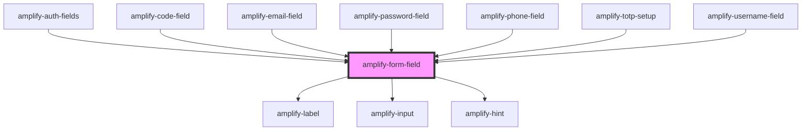

# amplify-form-field

<!-- Auto Generated Below -->

## Properties

| Property            | Attribute     | Description                                                                                                                                        | Type                                                                                            | Default     |
| ------------------- | ------------- | -------------------------------------------------------------------------------------------------------------------------------------------------- | ----------------------------------------------------------------------------------------------- | ----------- |
| `description`       | `description` | The text of the description.  Goes between the label and the input.                                                                                | `string`                                                                                        | `undefined` |
| `disabled`          | `disabled`    | Will disable the input if set to true                                                                                                              | `boolean`                                                                                       | `undefined` |
| `fieldId`           | `field-id`    | The ID of the field. Should match with its corresponding input's ID.                                                                               | `string`                                                                                        | `undefined` |
| `handleInputChange` | --            | The callback, called when the input is modified by the user.                                                                                       | `(inputEvent: Event) => void`                                                                   | `undefined` |
| `hint`              | `hint`        | The text of a hint to the user as to how to fill out the input. Goes just below the input.                                                         | `FunctionalComponent<{}> \| string`                                                             | `undefined` |
| `inputProps`        | --            | Attributes places on the input element: https://developer.mozilla.org/en-US/docs/Web/HTML/Element/input#Attributes                                 | `object`                                                                                        | `undefined` |
| `label`             | `label`       | The text of the label. Goes above the input. Ex: 'First name'                                                                                      | `string`                                                                                        | `undefined` |
| `name`              | `name`        | (Optional) String value for the name of the input.                                                                                                 | `string`                                                                                        | `undefined` |
| `placeholder`       | `placeholder` | (Optional) The placeholder for the input element.  Using hints is recommended, but placeholders can also be useful to convey information to users. | `string`                                                                                        | `''`        |
| `required`          | `required`    | The required flag in order to make an input required prior to submitting a form                                                                    | `boolean`                                                                                       | `false`     |
| `type`              | `type`        | The input type.  Can be any HTML input type.                                                                                                       | `"date" \| "email" \| "number" \| "password" \| "search" \| "tel" \| "text" \| "time" \| "url"` | `'text'`    |
| `value`             | `value`       | The value of the content inside of the input field                                                                                                 | `string`                                                                                        | `undefined` |

## Slots

| Slot      | Description                                 |
| --------- | ------------------------------------------- |
| `"input"` | Content for the input within the form field |

## Dependencies

### Used by

 - [amplify-auth-fields](../amplify-auth-fields)
 - [amplify-code-field](../amplify-code-field)
 - [amplify-email-field](../amplify-email-field)
 - [amplify-password-field](../amplify-password-field)
 - [amplify-phone-field](../amplify-phone-field)
 - [amplify-totp-setup](../amplify-totp-setup)
 - [amplify-username-field](../amplify-username-field)

### Depends on

- [amplify-label](../amplify-label)
- [amplify-input](../amplify-input)
- [amplify-hint](../amplify-hint)

### Graph

----------------------------------------------

*Built with [StencilJS](https://stenciljs.com/)*
