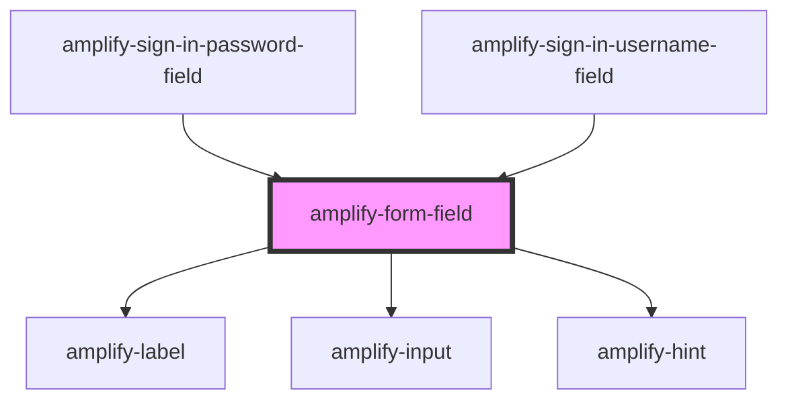

# amplify-form-field

<!-- Auto Generated Below -->

## Properties

| Property     | Attribute  | Description | Type                                                         | Default     |
| ------------ | ---------- | ----------- | ------------------------------------------------------------ | ----------- |
| `fieldId`    | `field-id` |             | `string`                                                     | `undefined` |
| `hint`       | `hint`     |             | `string`                                                     | `undefined` |
| `inputProps` | --         |             | `{ type?: TextFieldTypes; onInput?: (Event: any) => void; }` | `{}`        |
| `label`      | `label`    |             | `string`                                                     | `undefined` |

## Dependencies

### Used by

 - [amplify-sign-in-password-field](../amplify-sign-in-password-field)
 - [amplify-sign-in-username-field](../amplify-sign-in-username-field)

### Depends on

- [amplify-label](../amplify-label)
- [amplify-input](../amplify-input)
- [amplify-hint](../amplify-hint)

### Graph

----------------------------------------------

*Built with [StencilJS](https://stenciljs.com/)*
