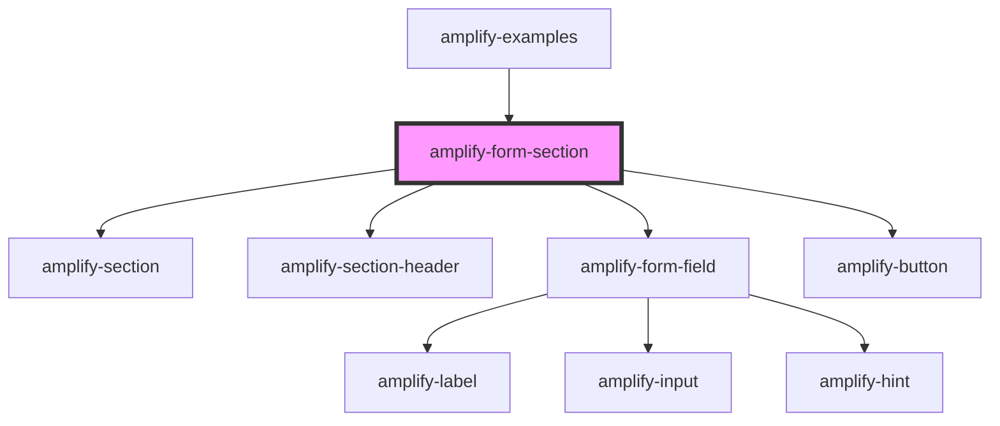

# amplify-form-section

<!-- Auto Generated Below -->

## Properties

| Property        | Attribute        | Description                                                           | Type                          | Default     |
| --------------- | ---------------- | --------------------------------------------------------------------- | ----------------------------- | ----------- |
| `buttonLabel`   | `button-label`   | (Optional) Used as a the default value within the default footer slot | `string`                      | `'Submit'`  |
| `handleSubmit`  | --               | (Required) Submit function used when form is submitted                | `(inputEvent: Event) => void` | `undefined` |
| `overrideStyle` | `override-style` | (Optional) Overrides default styling                                  | `boolean`                     | `false`     |

## Dependencies

### Used by

 - [amplify-examples](../amplify-examples)

### Depends on

- [amplify-section](../amplify-section)
- [amplify-section-header](../amplify-section-header)
- [amplify-form-field](../amplify-form-field)
- [amplify-button](../amplify-button)

### Graph

----------------------------------------------

*Built with [StencilJS](https://stenciljs.com/)*
