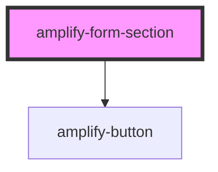

# amplify-form-section

<!-- Auto Generated Below -->

## Properties

| Property        | Attribute        | Description                          | Type      | Default    |
| --------------- | ---------------- | ------------------------------------ | --------- | ---------- |
| `buttonLabel`   | `button-label`   | Label for submit button              | `string`  | `'Submit'` |
| `styleOverride` | `style-override` | (Optional) Overrides default styling | `boolean` | `false`    |

## Dependencies

### Depends on

- [amplify-button](../amplify-button)

### Graph

----------------------------------------------

*Built with [StencilJS](https://stenciljs.com/)*
