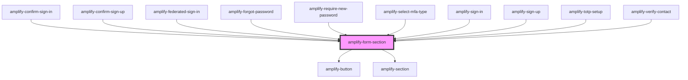

# amplify-form-section

<!-- Auto Generated Below -->

## Properties

| Property                 | Attribute                  | Description                                                                                      | Type                                | Default                                                                                                                                                                                    |
| ------------------------ | -------------------------- | ------------------------------------------------------------------------------------------------ | ----------------------------------- | ------------------------------------------------------------------------------------------------------------------------------------------------------------------------------------------ |
| `handleSubmit`           | --                         | (Required) Function called upon submission of form                                               | `(inputEvent: Event) => void`       | `undefined`                                                                                                                                                                                |
| `headerText`             | `header-text`              | Used for form section header                                                                     | `string`                            | `'Amplify'`                                                                                                                                                                                |
| `overrideStyle`          | `override-style`           | (Optional) Overrides default styling                                                             | `boolean`                           | `false`                                                                                                                                                                                    |
| `primaryFooterContent`   | `primary-footer-content`   |                                                                                                  | `FunctionalComponent<{}> \| string` | `( <amplify-button type="submit" overrideStyle={this.overrideStyle} data-test={this.testDataPrefix + '-' + this.testDataPrefix + '-button'} > {this.submitButtonText} </amplify-button> )` |
| `secondaryFooterContent` | `secondary-footer-content` |                                                                                                  | `FunctionalComponent<{}> \| string` | `null`                                                                                                                                                                                     |
| `submitButtonText`       | `submit-button-text`       | (Optional) Used as a the default value within the default footer slot                            | `string`                            | `'Submit'`                                                                                                                                                                                 |
| `testDataPrefix`         | `test-data-prefix`         | String prefix for the data-test attributes in this component primarily used for testing purposes | `string`                            | `'form-section'`                                                                                                                                                                           |

## Dependencies

### Used by

- [amplify-confirm-sign-in](../amplify-confirm-sign-in)
- [amplify-confirm-sign-up](../amplify-confirm-sign-up)
- [amplify-federated-sign-in](../amplify-federated-sign-in)
- [amplify-forgot-password](../amplify-forgot-password)
- [amplify-require-new-password](../amplify-require-new-password)
- [amplify-select-mfa-type](../amplify-select-mfa-type)
- [amplify-sign-in](../amplify-sign-in)
- [amplify-sign-up](../amplify-sign-up)
- [amplify-totp-setup](../amplify-totp-setup)
- [amplify-verify-contact](../amplify-verify-contact)

### Depends on

- [amplify-button](../amplify-button)
- [amplify-section](../amplify-section)

### Graph

---

_Built with [StencilJS](https://stenciljs.com/)_
