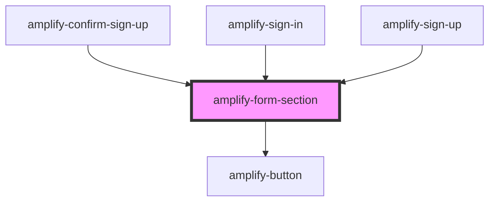

# amplify-form-section

<!-- Auto Generated Below -->

## Properties

| Property                 | Attribute                  | Description                                                           | Type                                | Default                                                                                                                           |
| ------------------------ | -------------------------- | --------------------------------------------------------------------- | ----------------------------------- | --------------------------------------------------------------------------------------------------------------------------------- |
| `handleSubmit`           | --                         | (Required) Function called upon submission of form                    | `(inputEvent: Event) => void`       | `undefined`                                                                                                                       |
| `headerText`             | `header-text`              | Used for form section header                                          | `string`                            | `'Amplify'`                                                                                                                       |
| `overrideStyle`          | `override-style`           | (Optional) Overrides default styling                                  | `boolean`                           | `false`                                                                                                                           |
| `primaryFooterContent`   | `primary-footer-content`   |                                                                       | `FunctionalComponent<{}> \| string` | `(     <amplify-button type="submit" overrideStyle={this.overrideStyle}>       {this.submitButtonText}     </amplify-button>   )` |
| `secondaryFooterContent` | `secondary-footer-content` |                                                                       | `FunctionalComponent<{}> \| string` | `null`                                                                                                                            |
| `submitButtonText`       | `submit-button-text`       | (Optional) Used as a the default value within the default footer slot | `string`                            | `'Submit'`                                                                                                                        |

## Dependencies

### Used by

 - [amplify-forgot-password](../amplify-forgot-password)
 - [amplify-sign-in](../amplify-sign-in)
 - [amplify-sign-up](../amplify-sign-up)

### Depends on

- [amplify-button](../amplify-button)

### Graph

----------------------------------------------

*Built with [StencilJS](https://stenciljs.com/)*
