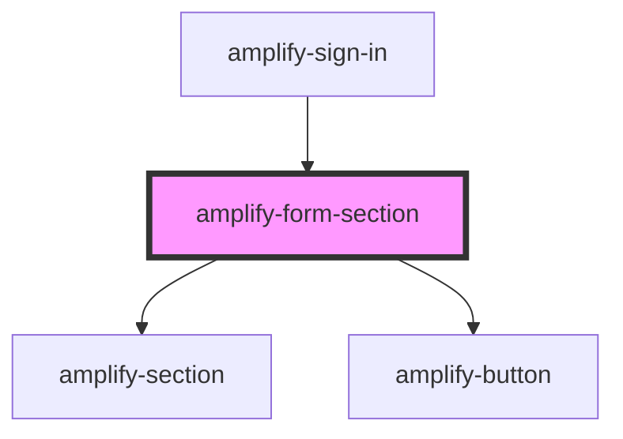

# amplify-form-section

<!-- Auto Generated Below -->

## Properties

| Property           | Attribute            | Description                                                           | Type                          | Default     |
| ------------------ | -------------------- | --------------------------------------------------------------------- | ----------------------------- | ----------- |
| `handleSubmit`     | --                   | (Required) Function called upon submission of form                    | `(inputEvent: Event) => void` | `undefined` |
| `headerText`       | `header-text`        | Used for form section header                                          | `string`                      | `'Amplify'` |
| `overrideStyle`    | `override-style`     | (Optional) Overrides default styling                                  | `boolean`                     | `false`     |
| `submitButtonText` | `submit-button-text` | (Optional) Used as a the default value within the default footer slot | `string`                      | `'Submit'`  |

## Dependencies

### Used by

 - [amplify-sign-in](../amplify-sign-in)

### Depends on

- [amplify-section](../amplify-section)
- [amplify-button](../amplify-button)

### Graph

----------------------------------------------

*Built with [StencilJS](https://stenciljs.com/)*
