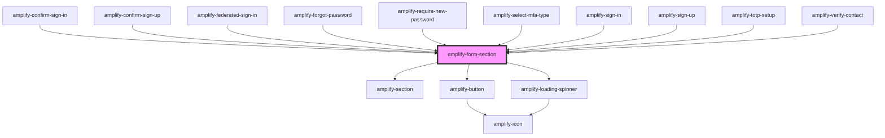

# amplify-form-section

<!-- Auto Generated Below -->

## Properties

| Property                 | Attribute                  | Description                                                                                      | Type                                | Default          |
| ------------------------ | -------------------------- | ------------------------------------------------------------------------------------------------ | ----------------------------------- | ---------------- |
| `handleSubmit`           | --                         | (Required) Function called upon submission of form                                               | `(event: Event) => void`            | `undefined`      |
| `headerText`             | `header-text`              | Used for form section header                                                                     | `string`                            | `undefined`      |
| `loading`                | `loading`                  | Loading state for the form                                                                       | `boolean`                           | `false`          |
| `secondaryFooterContent` | `secondary-footer-content` | Secondary footer component or text                                                               | `FunctionalComponent<{}> \| string` | `null`           |
| `submitButtonText`       | `submit-button-text`       | (Optional) Used as a the default value within the default footer slot                            | `string`                            | `'Submit'`       |
| `testDataPrefix`         | `test-data-prefix`         | String prefix for the data-test attributes in this component primarily used for testing purposes | `string`                            | `'form-section'` |

## Slots

| Slot                            | Description                                                                |
| ------------------------------- | -------------------------------------------------------------------------- |
| `"amplify-form-section-footer"` | Content for the footer section.                                            |
| `"amplify-form-section-header"` | Content for the header section                                             |
| `"subtitle"`                    | Content for the subtitle. This is inside of `amplify-form-section-header`. |

## CSS Custom Properties

| Name               | Description                        |
| ------------------ | ---------------------------------- |
| `--font-family`    | Text font family within the footer |
| `--font-weight`    | Text weight within the footer      |
| `--footer-color`   | Text color within the footer       |
| `--footer-size`    | Text size within the footer        |
| `--header-color`   | Text color within the form header  |
| `--header-size`    | Text size within the form header   |
| `--subtitle-color` | Text color within the subtitle     |
| `--subtitle-size`  | Text size within the subtitle      |

## Dependencies

### Used by

 - [amplify-confirm-sign-in](../amplify-confirm-sign-in)
 - [amplify-confirm-sign-up](../amplify-confirm-sign-up)
 - [amplify-federated-sign-in](../amplify-federated-sign-in)
 - [amplify-forgot-password](../amplify-forgot-password)
 - [amplify-require-new-password](../amplify-require-new-password)
 - [amplify-select-mfa-type](../amplify-select-mfa-type)
 - [amplify-sign-in](../amplify-sign-in)
 - [amplify-sign-up](../amplify-sign-up)
 - [amplify-totp-setup](../amplify-totp-setup)
 - [amplify-verify-contact](../amplify-verify-contact)

### Depends on

- [amplify-section](../amplify-section)
- [amplify-button](../amplify-button)
- [amplify-loading-spinner](../amplify-loading-spinner)

### Graph

----------------------------------------------

*Built with [StencilJS](https://stenciljs.com/)*
