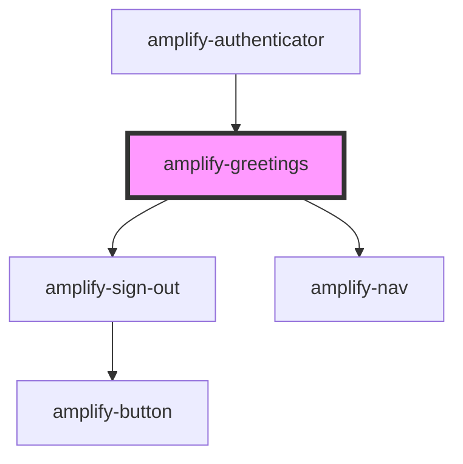

# amplify-greetings

<!-- Auto Generated Below -->

## Properties

| Property                | Attribute | Description                                                                      | Type                                                | Default                                                    |
| ----------------------- | --------- | -------------------------------------------------------------------------------- | --------------------------------------------------- | ---------------------------------------------------------- |
| `handleAuthStateChange` | --        | Passed from the Authenticatior component in order to change Authentication state | `(nextAuthState: AuthState, data?: object) => void` | `undefined`                                                |
| `logo`                  | --        | Logo displayed inside of the header                                              | `object`                                            | `null`                                                     |
| `navItems`              | --        | Items shown in navigation                                                        | `object[]`                                          | `[Hello, {'username'}, <amplify-sign-out />]` |
| `user`                  | --        | Used for the username to be passed to resend code                                | `CognitoUserInterface`                              | `null`                                                     |

## Dependencies

### Used by

 - [amplify-authenticator](../amplify-authenticator)

### Depends on

- [amplify-sign-out](../amplify-sign-out)
- [amplify-nav](../amplify-nav)

### Graph

----------------------------------------------

*Built with [StencilJS](https://stenciljs.com/)*
