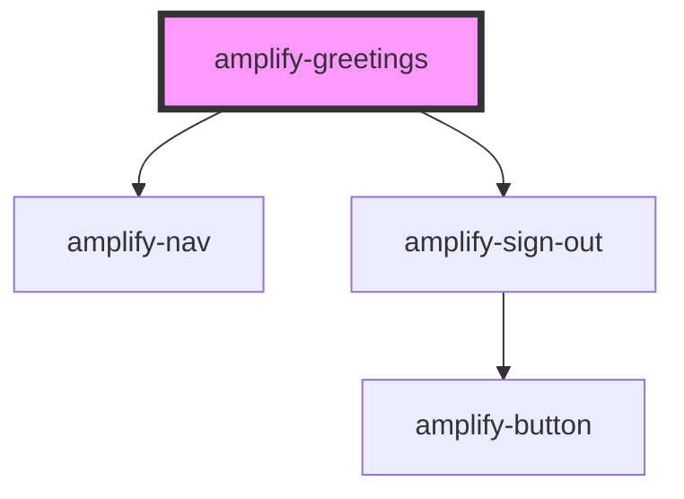

# amplify-greetings

<!-- Auto Generated Below -->

## Properties

| Property                | Attribute  | Description                                  | Type                                                | Default                        |
| ----------------------- | ---------- | -------------------------------------------- | --------------------------------------------------- | ------------------------------ |
| `handleAuthStateChange` | --         | Auth state change handler for this component | `(nextAuthState: AuthState, data?: object) => void` | `dispatchAuthStateChangeEvent` |
| `logo`                  | --         | Logo displayed inside of the header          | `FunctionalComponent<{}>`                           | `null`                         |
| `username`              | `username` | Username displayed in the greetings          | `string`                                            | `null`                         |

## Slots

| Slot                  | Description                                                     |
| --------------------- | --------------------------------------------------------------- |
| `"greetings-message"` | Content placed in the greetings text                            |
| `"logo"`              | Left-justified content placed at the start of the greetings bar |
| `"nav"`               | Right-justified content placed at the end of the greetings bar  |

## Dependencies

### Depends on

- [amplify-nav](../amplify-nav)
- [amplify-sign-out](../amplify-sign-out)

### Graph

----------------------------------------------

*Built with [StencilJS](https://stenciljs.com/)*
